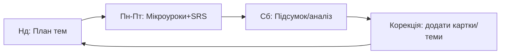

круто. робимо “систему без коду”: підбираємо готові сервіси й збираємо їх у щоденний ритуал + тижневий цикл. усе працює з телефона.

# 1) Стек без коду (мінімум інструментів)

**Навчання:**

* Уроки/граматика: British Council LearnEnglish, BBC Learning English, Perfect English Grammar.
* Лексика (SRS): Anki / Quizlet (будь-що зручніше).
* Вимова/аудіювання: YouGlish (живі приклади вимови), BBC “6 Minute English”, VOA Learning English.
* Письмо: Cambridge Write & Improve (автофідбек на короткі тексти).
* Читання: Readlang (браузер/мобільний веб) + News in Levels.

**Організація й звички:**

* Щоденні нагадування: Google Calendar або Telegram-нагадування.
* Трекінг: Notion або Google Sheets (шаблон нижче).
* Мотивація: паперовий “стікер-трекер” на холодильнику (7 клітинок/тиждень).

**Опціонально (за бажанням):**

* Говоріння з фідбеком: Speechling / Elsa.
* Розбір відео з субтитрами: Language Reactor (YouTube/Netflix).

---

# 2) Щоденний ритуал 15–20 хв (Kaizen)

1. **Розігрів 2 хв** — “слово дня” (бот/картка) + 1 приклад на YouGlish.
2. **Міні-урок 8–10 хв** — одна тема/вправи з British Council/BBC.
3. **SRS 5–7 хв** — 10–20 карток у Anki/Quizlet (повтори + 3 нові).
4. **1 речення письма 1–2 хв** — коротка репліка у Write & Improve (2–3 рази/тиждень).

> Правило мінімуму: якщо зовсім нема сил — зроби лише пункт 3 (SRS ≤3 хв). Стрік не обривається.

---

# 3) Тижневий цикл (система, а не просто уроки)

* **Пн–Пт:** щоденний ритуал (одна мікротема/день).
* **Сб (15 хв):** підсумок тижня: 1 короткий диктант (з відео/аудіо), 1 абзац письма, розбір 5 типових помилок.
* **Нд (5 хв):** план наступного тижня: 5 нових мінітем + додати 15–20 карток у SRS.

---

# 4) Конкретні “рецепти” (як клеїти все разом)

* **Вимова:** щодня 1 слово/фраза → пошук у YouGlish → 3 відео-приклади → повторити вголос → записати собі в Telegram voice (щоб чути прогрес).
* **Лексика:** робити власні картки (слово → переклад/картинка → 1 приклад). Краще 3 нових/день, ніж 30 раз на тиждень.
* **Граматика:** кожна тема = 1 коротке пояснення + 3 вправи з British Council. Не збираємо “все відразу”.
* **Письмо:** 2×/тиждень — 3–5 речень у Write & Improve. Зберігати приклади “до/після”.
* **Аудіювання:** 6 Minute English (6 хв) → занотувати 3 нові фрази в SRS.

---

# 5) Трекінг без коду (скопіюй у Notion/Sheets)

| Дата | Тема дня | Нові слова | Повтори SRS | % правильних у вправах | Аудіо (так/ні) | 1 фраза письма (так/ні) | Настрій/нотатка |
|------|----------|------------|-------------|-------------------------|----------------|--------------------------|-----------------|
| 2025-08-25 | Present Simple (пит.) | 3 | 18 | 80% | так | ні | «Було легко» |

**Щотижневі підсумки:**

* Скільки днів із 7 закрито?
* 3 найчастіші помилки (→ в план наступного тижня).
* 10 найповільніших карток у SRS (→ окремо пропрацювати з прикладами на YouGlish).

---

# 6) Пілотний план A1 → 4 тижні (без коду й платних курсів)

**Тиждень 1:** Family, Present Simple (+/−/?), фонетика /æ/ vs /ʌ/.
**Тиждень 2:** Daily routines, час/частотні прислівники, правопис 3rd person -s.
**Тиждень 3:** Home & places, There is/are, артиклі a/an/the (базово).
**Тиждень 4:** Food & shopping, Count/Uncount, some/any, much/many.

Кожен день — 1 підтема (лінк на матеріал BBC/BC) + 3 картки лексики + 1 вимовна вправа на YouGlish.

---

# 7) Фізичні “якорі”, щоб система трималась

* Роздрукований **стікер-трекер** на холодильнику: 5 стікерів/тиждень = маленький приз.
* Наклейка на ноут/телефон: “15 хв англійської перед соцмережами”.
* Спільний 10-хв івент у календарі з тобою 1×/тиждень: короткий review і похвала.

---

# 8) Варіанти під різні смаки

* **Ультралегко (тільки телефон):** Duolingo/Quizlet + YouGlish + 6 Minute English + Telegram-нагадування.
* **Баланс:** BBC/British Council + Anki + Write & Improve + Readlang + календар.
* **Максимум практики:** Speechling/Elsa + Language Reactor для відео + щотижневий міні-розмовний кол із другом/репетитором 20 хв.

---

# 9) Що дам від мене (готові шаблони)

* Шаблон таблиці прогресу (вище).
* Список стартових тем на 2 тижні з посиланнями на матеріали BBC/BC.
* Інструкцію “Як додавати ефективні картки в Anki/Quizlet” (з прикладом формату).

скажи, який варіант стеку беремо (ультралегко / баланс / максимум практики), і я під це зразу накидаю конкретний тижневий план з посиланнями та списком карток на перші 3 дні.
