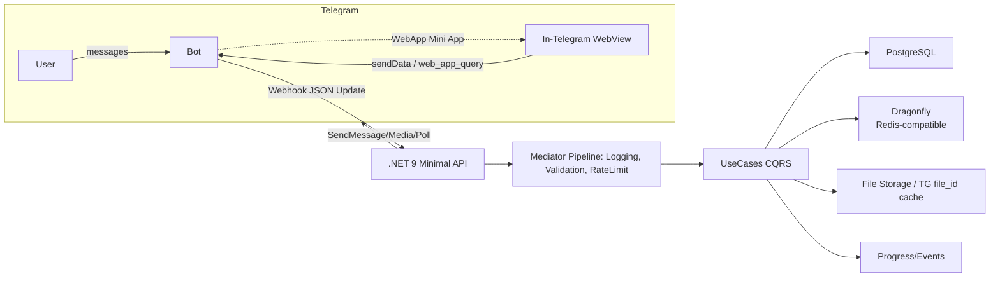

Класно! Зібрав для тебе “мапу можливостей” Telegram Bot’а саме під навчальні матеріали (текст/зображення/аудіо/відео/вікторини) + як це зручно класти на .NET 9, PostgreSQL і Dragonfly у стилі CQRS.

# Що вміє Telegram Bot для контенту

**Як доставляти оновлення боту**

* **Webhooks** (рекомендовано для продакшну): Telegram пушить `Update` на твій HTTPS-ендпойнт. ([core.telegram.org][1])
* **Long polling**: бот періодично тягне `getUpdates`. Обидва варіанти дають однакові `Update`. ([core.telegram.org][1])

**Формати повідомлень і форматування**

* **Текст**: до **4096** символів після парсингу ентитіз. Підтримка **MarkdownV2/HTML** (жирний, курсив, підкреслення, ~~закреслення~~, **спойлери**, цитати/розгорні цитати, інлайн-посилання, `code`, `pre` з підсвіткою). ([core.telegram.org][1])
* **Медіа + підписи**: caption до **0–1024** символів (після парсингу). Є опція показувати caption **над** медіа. ([core.telegram.org][1])
* **Зображення**: `sendPhoto` (з caption + форматування). ([core.telegram.org][1])
* **Відео / GIF (animation) / video notes**: `sendVideo`, `sendAnimation`, `sendVideoNote`. ([core.telegram.org][1])
* **Аудіо**: `sendAudio` (треки з метаданими) і `sendVoice` (голосові). ([core.telegram.org][1])
* **Документи/PDF**: `sendDocument`. ([core.telegram.org][1])
* **Альбоми (media groups)**: **2–10** елементів у пакеті: фото/відео, а також документи/аудіо з обмеженнями групування (зазвичай типи не змішують у одному альбомі). ([Pipedream][2], [docs.aiogram.dev][3])
* **Опитування й вікторини**: `sendPoll` із типом `"quiz"`, `correct_option_id`, поясненням тощо. З **липня 2025**—до **12 варіантів** у poll. ([core.telegram.org][4])
* **Лінк-прев’ю**: гнучкі `LinkPreviewOptions`. ([core.telegram.org][1])
* **Захист контенту**: `protect_content` забороняє пересилання/збереження. ([core.telegram.org][1])
* **Повторне використання файлів**: після завантаження користуйся `file_id` (без повторних аплоадів). ([core.telegram.org][1])
* **Ліміти відправки**: типово **до 30 повідомлень/сек** (є “Paid Broadcasts” для 1000/сек у зірках). Обов’язково обробляй 429. ([core.telegram.org][1])
* **Великі файли/швидке скачування**: локальний Bot API сервер дозволяє **upload до 2000 MB** і інші плюшки. ([core.telegram.org][1])

**Інтерактивність**

* **Клавіатури**: Reply/Inline. Для inline-кнопок `callback_data` ≤ **64 байти** (клади лише короткі токени/ключі стану). ([core.telegram.org][1])
* **Web Apps (Mini Apps)** всередині Telegram: відкриваються з кнопки `web_app`, можуть повертати дані боту через `Telegram.WebApp.sendData` (кнопка-клавіатура) або писати від імені користувача (inline-кнопка). Ідеально для складних форм, таблиць, інтерактивних вправ. ([core.telegram.org][5])

# Як показувати різний контент для уроків

* **Текстові уроки**: MarkdownV2/HTML + розділи/спойлери + навігація “Далі/Назад” на inline-кнопках. Слідкуй за ескейпом у MarkdownV2. ([core.telegram.org][1])
* **Зображення/схеми**: `sendPhoto` з підписом (до 1024 симв.). Серії ілюстрацій — через `sendMediaGroup`. ([core.telegram.org][1], [Pipedream][2])
* **Аудіо**:

  * **Слухання** — `sendAudio` (назва/виконавець/обкладинка);
  * **Speaking practice** — `sendVoice` (короткі голосові). ([core.telegram.org][1])
* **Відео**: `sendVideo` для роликів уроку; короткі підказки — `sendAnimation` (mp4-gif). ([core.telegram.org][1])
* **Таблиці**: у самому чаті таблиць нема — варіанти:

  1. Моноширинна “псевдо-таблиця” в `pre`;
  2. Картинка таблиці (PNG/PDF через `sendDocument`);
  3. **Mini App** із реальною HTML-таблицею + сортування/фільтри. ([core.telegram.org][1])
* **Вікторини**: `sendPoll(type="quiz")`, з `correct_option_id`, `explanation`. Результати трекаються `Update.poll`, або “закрий” poll (`stopPoll`) і зчитай фінал. ([Stack Overflow][6])

# Архітектура під .NET 9 + CQRS



* **Webhook endpoint** приймає `Update`, кидає в Mediator (Commands/Queries).
* **PostgreSQL**: користувачі, прогрес, спроби вікторин, мапа `lesson_asset_id → file_id`.
* **Dragonfly**: сесії/стани кроків уроку, throttling, дедуплікація апдейтів.
* **Файли**: перший upload — зберігаєш `file_id` → далі шлеш по `file_id` (миттєво). ([core.telegram.org][1])
* **Mini App**: коли потрібні таблиці, складні форми, валідація, графіки — відкривається з `web_app`-кнопки, повертає результат назад у бот. ([core.telegram.org][5])

# .NET 9: швидкий старт (C#)

**Пакет**

* Візьми офіційний `Telegram.Bot` (активно підтримується, приклади є, підтримує Bot API 9.x). ([GitHub][7])

**Webhook Minimal API (Program.cs)**

```csharp
using Telegram.Bot;
using Telegram.Bot.Types;
using Telegram.Bot.Types.Enums;

var builder = WebApplication.CreateBuilder(args);
builder.Services.AddHttpClient("tg").AddTypedClient<ITelegramBotClient>(http =>
    new TelegramBotClient(builder.Configuration["Telegram:Token"]!, http));

var app = builder.Build();

app.MapPost("/webhook/update", async (Update update, ITelegramBotClient bot, ILoggerFactory lf) =>
{
    var log = lf.CreateLogger("TG");
    try
    {
        switch (update.Type)
        {
            case UpdateType.Message when update.Message!.Text is { } text:
                await bot.SendMessage(update.Message.Chat.Id,
                    $"Привіт! Ти написав: <b>{System.Net.WebUtility.HtmlEncode(text)}</b>",
                    parseMode: ParseMode.Html);
                break;

            case UpdateType.CallbackQuery:
                var data = update.CallbackQuery!.Data; // ≤ 64 байти
                // TODO: Розпарси короткий токен, дістань стан із Dragonfly, виконай UseCase
                await bot.AnswerCallbackQuery(update.CallbackQuery.Id);
                break;

            case UpdateType.PollAnswer:
                // збереги відповідь користувача на вікторину
                break;
        }
    }
    catch (Exception ex)
    {
        log.LogError(ex, "Update handling failed");
    }
    return Results.Ok();
});

app.Run();
```

> Приклади для webhooks/Minimal API є в офіційному репо прикладів. ([GitHub][8])

**Надіслати текст + MarkdownV2**

```csharp
await bot.SendMessage(chatId,
    "*Lesson 1: Phrasal Verbs*\n" +
    "• to *pick up*\n• to _carry on_\n\n" +
    ">Hint: use them in sentences",
    parseMode: ParseMode.MarkdownV2);
```

(Екрануй спецсимволи згідно правил MarkdownV2). ([core.telegram.org][1])

**Фото з підписом**

```csharp
await bot.SendPhoto(chatId, InputFile.FromUri(imgUrl),
    caption: "<b>Present Simple</b>: he/she/it adds <code>-s</code>",
    parseMode: ParseMode.Html);
```

**Альбом (серія ілюстрацій)**

```csharp
var media = new IAlbumInputMedia[] {
    new InputMediaPhoto(InputFile.FromUri(url1)) { Caption = "Step 1" },
    new InputMediaPhoto(InputFile.FromUri(url2)) { Caption = "Step 2" },
};
await bot.SendMediaGroup(chatId, media);
```

(2–10 елементів; мікс фото/відео працює, документи/аудіо — з обмеженнями). ([Pipedream][2], [docs.aiogram.dev][3])

**Кнопки навігації**

```csharp
var kb = new InlineKeyboardMarkup(new[]
{
    new[] { InlineKeyboardButton.WithCallbackData("⬅️ Назад", "prev"), InlineKeyboardButton.WithCallbackData("Далі ➡️", "next") },
    new[] { InlineKeyboardButton.WithWebApp("Відкрити вправу", new WebAppInfo("https://your-mini-app.example/app")) }
});
await bot.SendMessage(chatId, "Урок 1: Вступ", replyMarkup: kb, parseMode: ParseMode.Html);
```

(Web App відкриється в Telegram і може повернути дані через `sendData` або надіслати повідомлення від імені користувача — залежно від типу кнопки). ([core.telegram.org][5])

**Вікторина (quiz)**

```csharp
var msg = await bot.SendPoll(
    chatId,
    question: "Choose the correct article:",
    options: new[] { "a apple", "an apple", "the apple", "—" },
    type: PollType.Quiz,
    correctOptionId: 1,
    explanation: "Перед голосними звуками вживаємо <b>an</b>.",
    explanationParseMode: ParseMode.Html
);
// Збережи msg.Chat.Id + msg.MessageId щоб пізніше зчитати/закрити poll
```

(До 12 опцій із Bot API 9.1). ([core.telegram.org][4])

# Поради з побудови уроків на Markdown

* Тримай **кроки** уроку невеликими: 300–700 символів + картинка/аудіо → краща утримуваність.
* Для таблиць — або **pre-блок**, або **PDF/зображення**, або **Mini App** для живих таблиць. ([core.telegram.org][1])
* `callback_data` — лише ключ, все інше в Dragonfly/Postgres (щоб не впертись у 64 байти). ([core.telegram.org][1])
* Кешуй `file_id` у БД, щоб не перезавантажувати важкий медіа. ([core.telegram.org][1])
* Враховуй ліміти (30 msg/s) та роби черги/бек-оф. ([core.telegram.org][1])

# Коли потрібен Mini App (Web App)

* Складні форми (рівні, тарифи, оплати, прогрес-дашборди), **живі таблиці**, вправи з drag-and-drop, таймери — усе це легше в Mini App і воно працює прямо в Telegram. Запуск через `web_app`-кнопки. ([core.telegram.org][5])

---

Хочеш — згенерую шаблон рішення (`.NET 9` Minimal API із webhook, інтеграцію `Telegram.Bot`, структуру `Application/Data/Infrastructure`, кеш Dragonfly, репозиторії Postgres, приклади команд/квізів, міграції) і мережу docker-compose під локальний старт.

[1]: https://core.telegram.org/bots/api "Telegram Bot API"
[2]: https://pipedream.com/apps/telegram-bot-api/actions/send-album?utm_source=chatgpt.com "Send an Album (Media Group) with Telegram API"
[3]: https://docs.aiogram.dev/en/latest/api/methods/send_media_group.html?utm_source=chatgpt.com "sendMediaGroup - aiogram 3.22.0 documentation"
[4]: https://core.telegram.org/bots/api-changelog?utm_source=chatgpt.com "Bot API changelog"
[5]: https://core.telegram.org/bots/webapps?utm_source=chatgpt.com "Telegram Mini Apps"
[6]: https://stackoverflow.com/questions/78325403/telegram-bot-get-poll-results?utm_source=chatgpt.com "Telegram bot - Get poll results"
[7]: https://github.com/TelegramBots/Telegram.Bot "GitHub - TelegramBots/Telegram.Bot: .NET Client for Telegram Bot API"
[8]: https://github.com/TelegramBots/Telegram.Bot.Examples?utm_source=chatgpt.com "Examples for the Telegram.Bot C# Library"
