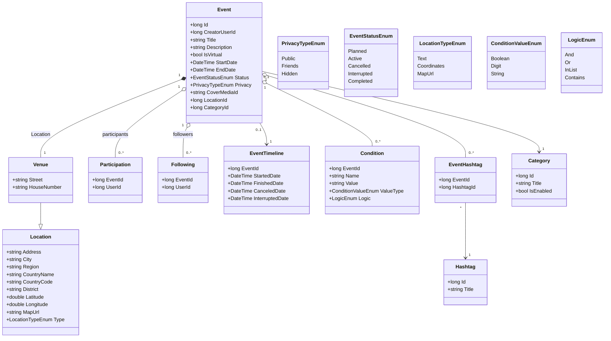
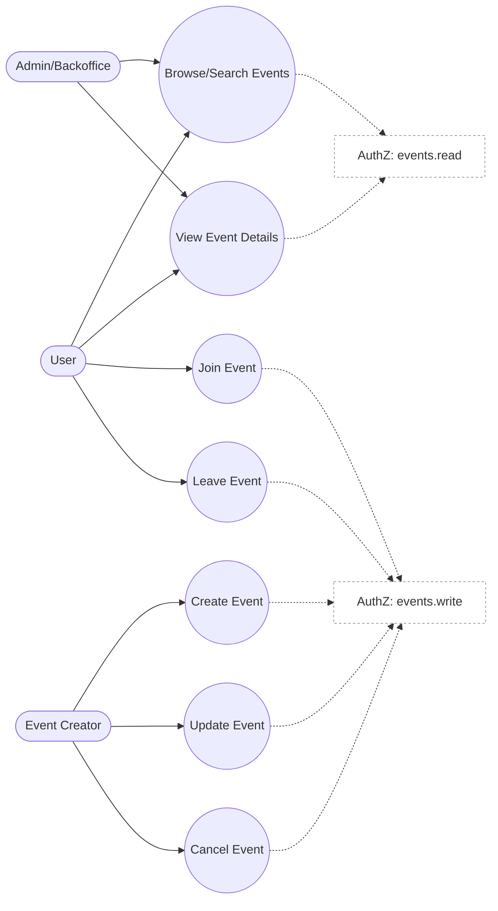
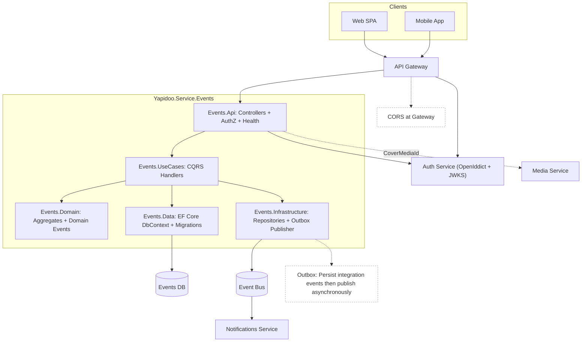

# Yapidoo Events Service — Diagrams

This file contains Mermaid diagrams for the Events service as described in `migration-guide.md`.

---

## Class Diagram

---

## Use Case Diagram

---

## Component Diagram

