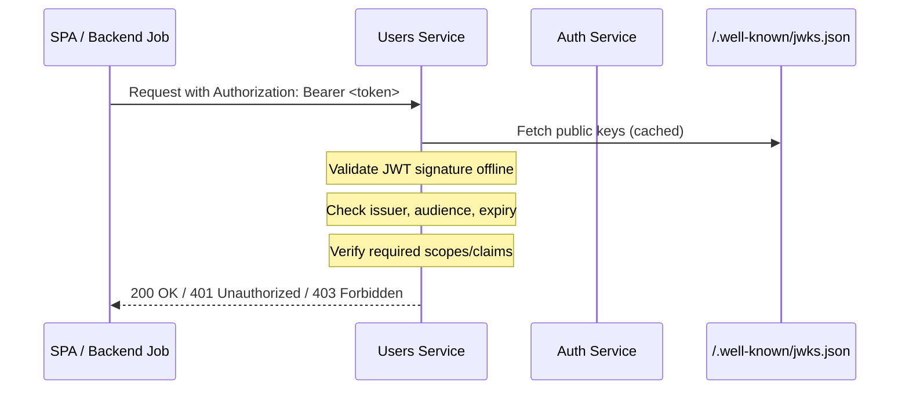

# AuthService Integration Guide for Resource APIs

This document provides instructions for integrating resource APIs (e.g., Users Service, Events Service) with the **Yapidoo AuthService** to validate tokens and enforce permissions.

[Back to Services Index](index.md) | [Auth Service Docs](auth/index.md)

---

## Introduction

The Yapidoo platform uses a centralized **AuthService** built on **OpenIddict** and **.NET 9** to issue and manage OAuth2/OIDC tokens. All resource APIs must integrate with AuthService to:

1. **Validate JWT access tokens** issued by AuthService
2. **Enforce authorization policies** based on scopes and claims
3. **Enable secure service-to-service communication** using Client Credentials flow

This guide uses the **Users Service** as a reference implementation, but the same patterns apply to all resource APIs (Events, Notifications, etc.).

### Token Validation Flow



---

## Main Concepts

### 1. JWKS (JSON Web Key Set)

AuthService automatically publishes its public signing keys at `/.well-known/jwks.json`. Resource APIs use these keys to validate JWT signatures **offline** without calling AuthService for every request.

- **Discovery endpoint**: `https://auth.<domain>/.well-known/openid-configuration`
- **JWKS endpoint**: `https://auth.<domain>/.well-known/jwks.json`
- Keys are cached by the JWT middleware; refresh happens automatically

### 2. Access Tokens (JWT)

AuthService issues short-lived JWT access tokens containing:

| Claim | Description |
|-------|-------------|
| `sub` | Subject (Identity User ID) |
| `aud` | Audience (e.g., `yapidoo.api`) |
| `iss` | Issuer (AuthService URL) |
| `scope` | Granted scopes (e.g., `openid profile users.read`) |
| `exp` | Expiration timestamp |
| Custom claims | Roles, permissions, etc. |

### 3. Scopes

Scopes define what actions a client can perform. Common scopes:

| Scope | Description |
|-------|-------------|
| `openid` | Required for OIDC flows |
| `profile` | Access to user profile info |
| `email` | Access to user email |
| `yapidoo.api` | General API access |
| `users.read` | Read user data |
| `users.write` | Modify user data |

### 4. Authorization Policies

Policies combine scope and claim requirements to control access to specific endpoints:

```csharp
// Example policy requiring users.write scope
options.AddPolicy("CanWriteUsers", policy =>
    policy.RequireScope("users.write"));
```

### 5. Trust Model

- **First-party clients** (SPA, mobile): Use Authorization Code + PKCE flow
- **Service-to-service** (M2M): Use Client Credentials flow with a confidential client
- **Resource APIs**: Trust tokens signed by AuthService; validate via JWKS

---

## Integration Steps

### Step 1: Install Required Packages

Add JWT Bearer authentication to your resource API:

```bash
dotnet add package Microsoft.AspNetCore.Authentication.JwtBearer
```

Alternatively, use OpenIddict validation:

```bash
dotnet add package OpenIddict.Validation.AspNetCore
```

### Step 2: Configure Authentication in Program.cs

#### Option A: Using JwtBearer (Recommended for simplicity)

```csharp
var builder = WebApplication.CreateBuilder(args);

// Configure JWT Bearer authentication
builder.Services.AddAuthentication("Bearer")
    .AddJwtBearer("Bearer", options =>
    {
        // AuthService URL (OIDC discovery endpoint)
        options.Authority = builder.Configuration["Auth:Authority"]; 
        // e.g., "https://auth.yapidoo.com"

        options.TokenValidationParameters = new TokenValidationParameters
        {
            ValidateIssuer = true,
            ValidateAudience = true,
            ValidAudience = "yapidoo.api",
            ValidateLifetime = true,
            ClockSkew = TimeSpan.FromMinutes(1)
        };

        // Require HTTPS in production
        options.RequireHttpsMetadata = !builder.Environment.IsDevelopment();
    });

builder.Services.AddAuthorization();

var app = builder.Build();

app.UseAuthentication();
app.UseAuthorization();

app.MapControllers();

app.Run();
```

#### Option B: Using OpenIddict Validation

```csharp
builder.Services.AddOpenIddict()
    .AddValidation(options =>
    {
        // Use remote server (AuthService) for validation
        options.SetIssuer(builder.Configuration["Auth:Authority"]);
        options.UseSystemNetHttp();
        options.UseAspNetCore();
    });

builder.Services.AddAuthentication(OpenIddictValidationAspNetCoreDefaults.AuthenticationScheme);
builder.Services.AddAuthorization();
```

### Step 3: Configure appsettings.json

```json
{
  "Auth": {
    "Authority": "https://auth.yapidoo.com",
    "Audience": "yapidoo.api"
  }
}
```

For local development:

```json
{
  "Auth": {
    "Authority": "https://localhost:5001",
    "Audience": "yapidoo.api"
  }
}
```

### Step 4: Define Authorization Policies

Add scope-based policies for fine-grained access control:

```csharp
builder.Services.AddAuthorization(options =>
{
    // Policy for reading user data
    options.AddPolicy("UsersRead", policy =>
        policy.RequireClaim("scope", "users.read"));

    // Policy for writing user data
    options.AddPolicy("UsersWrite", policy =>
        policy.RequireClaim("scope", "users.write"));

    // Policy requiring authenticated user
    options.AddPolicy("Authenticated", policy =>
        policy.RequireAuthenticatedUser());

    // Combined policy example
    options.AddPolicy("UsersAdmin", policy =>
        policy.RequireClaim("scope", "users.read")
              .RequireClaim("scope", "users.write"));
});
```

### Step 5: Protect Controllers/Endpoints

Apply authentication and authorization to your endpoints:

```csharp
[ApiController]
[Route("api/[controller]")]
[Authorize] // Requires any valid token
public class UsersController : ControllerBase
{
    // GET /api/users - requires users.read scope
    [HttpGet]
    [Authorize(Policy = "UsersRead")]
    public async Task<IActionResult> GetUsers()
    {
        // Access user claims
        var userId = User.FindFirst("sub")?.Value;
        var scopes = User.FindFirst("scope")?.Value;

        return Ok(await _userService.GetAllAsync());
    }

    // POST /api/users - requires users.write scope
    [HttpPost]
    [Authorize(Policy = "UsersWrite")]
    public async Task<IActionResult> CreateUser([FromBody] CreateUserDto dto)
    {
        return Ok(await _userService.CreateAsync(dto));
    }

    // GET /api/users/me - requires any authenticated user
    [HttpGet("me")]
    public async Task<IActionResult> GetCurrentUser()
    {
        var identityUserId = User.FindFirst("sub")?.Value;
        if (string.IsNullOrEmpty(identityUserId))
            return Unauthorized();

        return Ok(await _userService.GetByIdentityIdAsync(identityUserId));
    }
}
```

### Step 6: Handle Service-to-Service Calls (M2M)

For backend services calling each other, use the Client Credentials flow:

```csharp
public class AuthTokenService
{
    private readonly HttpClient _httpClient;
    private readonly IConfiguration _config;
    private string? _cachedToken;
    private DateTime _tokenExpiry;

    public AuthTokenService(HttpClient httpClient, IConfiguration config)
    {
        _httpClient = httpClient;
        _config = config;
    }

    public async Task<string> GetAccessTokenAsync()
    {
        // Return cached token if still valid
        if (_cachedToken != null && DateTime.UtcNow < _tokenExpiry.AddMinutes(-1))
            return _cachedToken;

        var tokenEndpoint = $"{_config["Auth:Authority"]}/connect/token";

        var request = new HttpRequestMessage(HttpMethod.Post, tokenEndpoint)
        {
            Content = new FormUrlEncodedContent(new Dictionary<string, string>
            {
                ["grant_type"] = "client_credentials",
                ["client_id"] = _config["Auth:ClientId"],
                ["client_secret"] = _config["Auth:ClientSecret"],
                ["scope"] = "yapidoo.api users.read"
            })
        };

        var response = await _httpClient.SendAsync(request);
        response.EnsureSuccessStatusCode();

        var tokenResponse = await response.Content
            .ReadFromJsonAsync<TokenResponse>();

        _cachedToken = tokenResponse!.AccessToken;
        _tokenExpiry = DateTime.UtcNow.AddSeconds(tokenResponse.ExpiresIn);

        return _cachedToken;
    }
}

record TokenResponse(
    [property: JsonPropertyName("access_token")] string AccessToken,
    [property: JsonPropertyName("expires_in")] int ExpiresIn);
```

### Step 7: Add Health Check for Auth Dependency

```csharp
builder.Services.AddHealthChecks()
    .AddUrlGroup(
        new Uri($"{builder.Configuration["Auth:Authority"]}/.well-known/openid-configuration"),
        name: "auth-service",
        failureStatus: HealthStatus.Degraded);
```

---

## Checklist

### Pre-Integration

- [ ] AuthService is deployed and accessible
- [ ] OIDC discovery endpoint responds: `GET /.well-known/openid-configuration`
- [ ] JWKS endpoint responds: `GET /.well-known/jwks.json`
- [ ] Required scopes are registered in AuthService (e.g., `users.read`, `users.write`)
- [ ] M2M client is seeded in AuthService (for service-to-service calls)

### Configuration

- [ ] `Auth:Authority` configured in appsettings.json
- [ ] `Auth:Audience` matches token audience claim
- [ ] HTTPS enforcement enabled in production (`RequireHttpsMetadata = true`)
- [ ] Development settings configured for local testing

### Authentication Setup

- [ ] JWT Bearer or OpenIddict Validation package installed
- [ ] Authentication configured in `Program.cs`
- [ ] `UseAuthentication()` called before `UseAuthorization()`
- [ ] Authorization middleware registered

### Authorization Policies

- [ ] Scope-based policies defined for API operations
- [ ] `[Authorize]` attribute applied to protected controllers/endpoints
- [ ] Policy names match expected scopes from AuthService

### Endpoint Protection

- [ ] All sensitive endpoints require authentication
- [ ] Write operations require appropriate scopes
- [ ] User context (`sub` claim) extracted correctly
- [ ] 401 returned for missing/invalid tokens
- [ ] 403 returned for insufficient permissions

### Service-to-Service (if applicable)

- [ ] M2M client credentials configured securely (secrets in vault)
- [ ] Token caching implemented to avoid excessive token requests
- [ ] Token refresh logic handles expiration

### Testing

- [ ] Verified token validation with valid JWT
- [ ] Verified 401 response for missing token
- [ ] Verified 401 response for expired token
- [ ] Verified 403 response for missing required scope
- [ ] Verified M2M flow with Client Credentials (if applicable)
- [ ] Load tested JWKS caching behavior

### Production Readiness

- [ ] Health check includes AuthService connectivity
- [ ] Logging captures auth failures for debugging
- [ ] CORS configured if needed for SPA access
- [ ] Clock sync verified (token expiry validation)
- [ ] TLS/HTTPS enabled end-to-end

---

## Troubleshooting

### Common Issues

| Issue | Cause | Solution |
|-------|-------|----------|
| 401 on all requests | Invalid Authority URL | Verify `Auth:Authority` points to AuthService |
| 401 with valid token | Audience mismatch | Ensure `ValidAudience` matches token `aud` claim |
| 401 intermittently | Clock skew | Increase `ClockSkew` or sync server clocks |
| 403 despite scope | Claim name mismatch | Check if scope is in `scope` or `scp` claim |
| JWKS fetch fails | Network/firewall issue | Verify connectivity to AuthService |

### Debugging Token Issues

```csharp
// Decode and log token claims for debugging
[HttpGet("debug-token")]
[Authorize]
public IActionResult DebugToken()
{
    var claims = User.Claims.Select(c => new { c.Type, c.Value });
    return Ok(claims);
}
```

---

## Related Documentation

- [Auth Service Architecture](/content/1-projects/yapidoo-development/services/auth/architecture.md)
- [Auth Service Overview & Concepts](/content/1-projects/yapidoo-development/services/auth/overview-and-concepts.md)
- [OpenIddict Integration](/content/1-projects/yapidoo-development/services/auth/openiddict-integration.md)
- [Auth Service Implementation](/content/1-projects/yapidoo-development/services/auth/implementation.md)

---

*Last updated: 2025-12-28*
