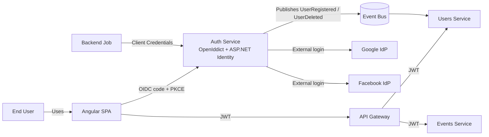
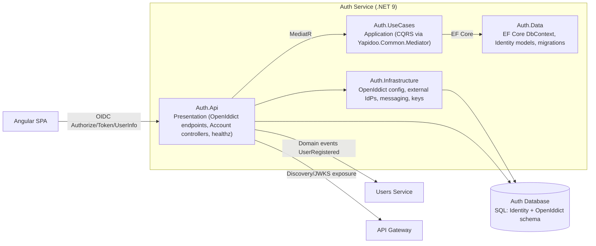
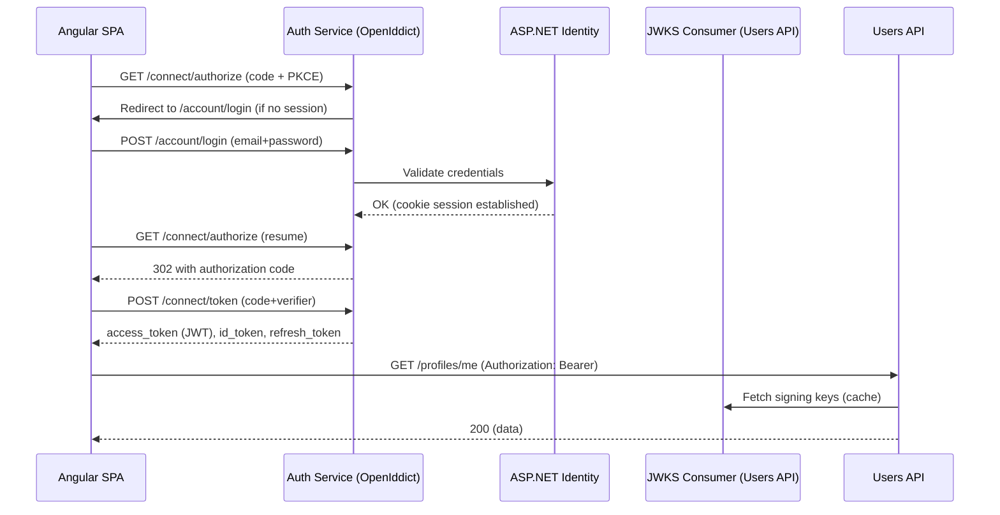
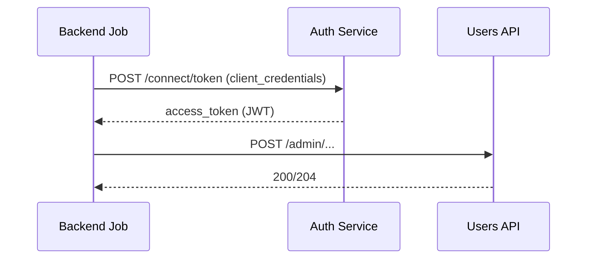
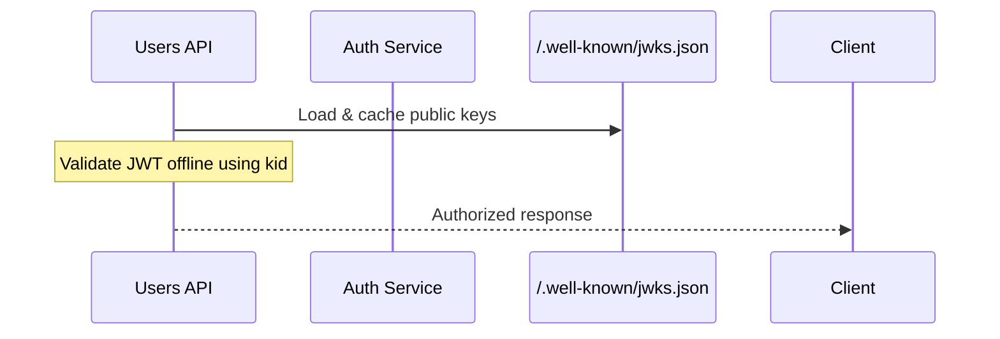
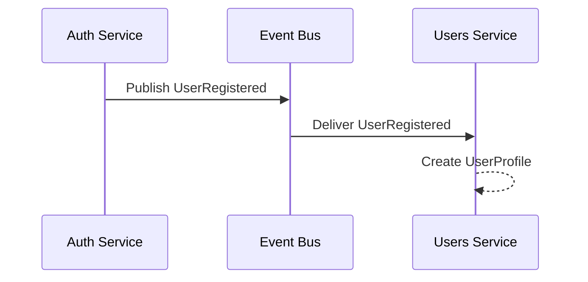
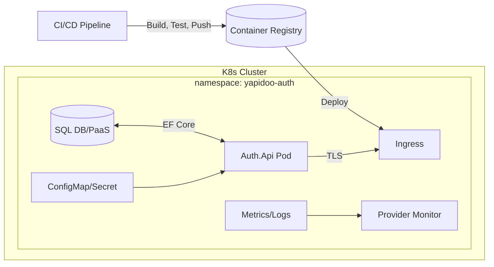

# Yapidoo Auth Service — High-Level Architecture & Implementation Guide (.NET 9 + OpenIddict)

This guide frames **why** and **what** we’re building for Yapidoo’s **Auth** microservice, then shows **how** the pieces fit together—so the team ships the right thing once, and evolves it cleanly.

---

## 1 Vision & Scope

### Intent

Build a **single, standards-compliant Identity & Authorization service** that:

* Authenticates users via **local credentials** and **external IdPs** (Google/Facebook).
* Issues **OIDC/OAuth2.1** tokens (**JWT** or reference tokens) to **first-party** clients (Angular SPA, mobile) and **service-to-service** actors.
* Enables **loose coupling** across microservices through **JWKS** key distribution, **scopes**, and **claims**.
* Publishes **minimal identity events** so the **Users service** can provision business profiles.

### Out of scope (owned by other services)

* Business profile data (name, preferences, friendships, avatars) → **Users service**
* Event domain logic, chat, notifications → respective services

---

## 2 Key Architectural Decisions

* **Protocol**: OpenID Connect + OAuth 2.1 (Authorization Code + **PKCE**, Refresh Tokens, Client Credentials).
* **Implementation**: **OpenIddict** on **.NET 9** with **ASP.NET Core Identity**.
* **Token Model**: Short-lived **access tokens** (JWT), rotating **refresh tokens**; optional **reference tokens** for instant revocation scenarios.
* **Authorization**: Scope-based + claims; policies enforced in resource APIs.
* **CQRS**: Commands/queries implemented in `Yapidoo.Service.Auth.UseCases` using **Yapidoo.Common.Mediator**.
* **Persistence**: EF Core, migrations in `Yapidoo.Service.Auth.Data`; Identity + OpenIddict tables.
* **Inter-service trust**: JWKS endpoint for key distribution; APIs validate JWT offline.
* **Eventing**: `UserRegistered`, `UserDeleted` published to the bus for the **Users** service.
* **Deployment**: Containerized, IaC-driven (Helm/K8s), provider monitoring.

---

## 3 Context View (C4: System Context)

---

## 4 Container View (C4: Containers & Major Components)

---

## 5 Runtime (Sequence) Views

### 5.1 Authorization Code + PKCE (SPA)

### 5.2 Machine-to-Machine (Client Credentials)

### 5.3 Token Validation via JWKS (Resource API)

---

## 6 Data View

* **Identity tables**: Users, Roles, UserRoles, ExternalLogins, Claims
* **OpenIddict tables**: Applications (clients), Authorizations, Tokens, Scopes
* **Design principles**:

  * Minimal PII in **access tokens** (use **userinfo** endpoint for rich identity)
  * **Short-lived** access tokens (e.g., 15m), **rotating** refresh tokens (e.g., 30d)
  * **Asymmetric keys** for signing; **JWKS** exposed

---

## 7 Security Posture

* **Flows**: Authorization Code + **PKCE** for SPA; **Client Credentials** for M2M
* **Key management**: RSA/X.509 from KMS/KeyVault; rotate and publish via JWKS
* **Revocation**: Prefer JWT with short TTL; use **reference tokens + introspection** if instant revocation is required at the gateway
* **Hardening**: Strict CORS & redirect URIs, rate-limit `/connect/token`, lockout & 2FA options, HTTPS-only + HSTS, CSP headers

---

## 8 Integration with Users Service

* On registration (local or first external login), emit **`UserRegistered { IdentityUserId, Email, DisplayName }`**.
* On deletion, emit **`UserDeleted { IdentityUserId }`**.
* Users service listens and **provisions/cleans** business profiles accordingly.

---

## 9 Deployment View

* **CI/CD**: Build (dotnet 9) → Test → Publish Docker → Helm deploy → DB migration Job.
* **Observability**: Serilog JSON logs; OpenTelemetry counters (issuance, failures, latency); provider-native dashboards/alerts.

---

## 10 Implementation Milestones (Outcomes)

1. **Identity & Data Ready**
   EF Core schema, Identity models, migrations in `Data`; DB provisioned.

2. **OpenIddict Online**
   OIDC endpoints (`/authorize`, `/token`, `/userinfo`, discovery, JWKS); clients seeded (SPA, M2M).

3. **CQRS Accounts**
   `Register`, `Login`, `Logout` commands wired; cookie session enables interactive OIDC flow.

4. **Clients Integrated**
   Angular SPA via Auth Code + PKCE; M2M via Client Credentials; resource APIs validate JWT via JWKS.

5. **Claims & Scopes**
   Minimal claims in tokens; `users.read`/`users.write` policies enforced in resource APIs.

6. **Keys & Hardening**
   Persisted signing keys; rate limits; strict CORS/redirects; short TTLs; refresh rotation.

7. **External IdPs**
   Google/Facebook login + account linking; continue OIDC flow.

8. **Eventing**
   `UserRegistered`/`UserDeleted` published; Users service provisions/cleans profiles.

9. **Operate & Scale**
   Dashboards/alerts; autoscale stateless Auth pods; blue/green or canary via Helm.

---

## 11 Success Criteria (Definition of Done)

* **Security**: OIDC/OAuth2.1 compliant; PKCE enforced; keys rotated; TLS everywhere.
* **Interoperability**: Discovery and **JWKS** available; resource services validate tokens **offline**.
* **Reliability**: Stateless Auth API; health/ready probes pass; token throughput meets SLOs.
* **Extensibility**: New scopes/clients added without code changes; external IdPs pluggable.
* **Observability**: Token issuance/failure metrics and logs actionable; alerts configured.
* **Separation of Concerns**: No business profile data in Auth; Users service owns user domain.

---

## 12 Risks & Mitigations

* **Token revocation timing** → Use short TTL JWTs; for instant revocation adopt **reference tokens + introspection** at gateway.
* **Key leakage** → Store in KMS/KeyVault; restrict RBAC; rotate and monitor.
* **Redirect/CORS misconfig** → Maintain allowlists per environment; test with e2e OIDC suite.
* **Scope creep in tokens** → Keep PII out of access tokens; prefer **userinfo**.

---

## 13 Final Result Snapshot

* A **hardened** Auth service that **issues/validates** standards-compliant tokens,
* clean **service boundaries** with Users and other APIs via **scopes/claims/JWKS**,
* **event-driven** provisioning of user profiles,
* **operable at scale** with clear metrics, dashboards, and automated delivery.
