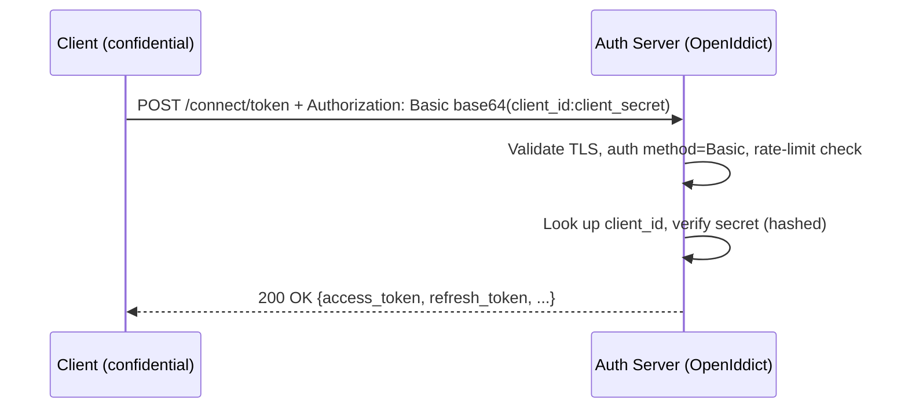

Here’s a focused, “what you need to know” guide for designing **Yapidoo.Service.Auth** (OpenIddict-based) around the OAuth 2.0 spec you referenced — specifically the parts about **client identifiers and client authentication**. I’ll anchor the requirements to the RFC so you can trace each rule back to source.

# Why this matters

In OAuth, *clients* (your SPA, mobile app, backend jobs, other microservices) must be registered and identified. The **client identifier (client\_id)** is the handle by which the Auth service recognizes them; the **authentication method** (e.g., client secret or key) is how confidential clients prove they are who they say they are. Getting this right determines which flows you can safely support and how you harden the token endpoint.

---

# Non‑negotiable requirements (from RFC 6749)

## Client identifier (Section 2.2)

* Your Auth service must issue each registered client a **client identifier** — “a unique string representing the registration information provided by the client.” It’s **not a secret** and **MUST NOT** be used alone for authentication. It’s unique **per authorization server**. ([datatracker.ietf.org][1])
* The spec leaves **identifier length unspecified**; clients **shouldn’t assume** a size. The server **SHOULD document** the sizes it issues. Action: publish a doc (or discovery metadata) stating your client\_id length policy. ([datatracker.ietf.org][1])
* The **client\_id** is a **required parameter** in authorization requests (authorization code and implicit). Your authorization endpoint must enforce its presence. ([datatracker.ietf.org][1])

## Client types (Section 2.1) — context you’ll rely on

* **Confidential** clients can keep credentials secret (e.g., backend services).
* **Public** clients cannot (e.g., SPA in browser, native apps). Don’t “upgrade” a public client by handing it a secret. ([datatracker.ietf.org][1])

## Client authentication (Sections 2.3 & 3.2.1)

* For **confidential clients**, you and the client must agree on an authentication method; the server may accept any method meeting its security requirements (password/secret, key pair, etc.). ([datatracker.ietf.org][1])
* **Do not rely** on public client authentication to identify the client (treat it as unauthenticated from the server’s perspective). Pair it with PKCE and redirect URI checks instead. ([datatracker.ietf.org][1])
* The client **MUST NOT use more than one authentication method in a request** (e.g., don’t send both Basic and body credentials). Enforce this in the token endpoint. ([datatracker.ietf.org][1])
* If you issue **client passwords/secrets**, the server **MUST support HTTP Basic** at the token endpoint for those clients; you **MAY** also allow credentials in the request body. Ensure your implementation supports both if you choose to allow the latter. ([datatracker.ietf.org][1])
* When using password/secret auth, **require TLS** and **protect against brute force** (rate limiting, lockouts). ([datatracker.ietf.org][1])

---

# How this maps to Yapidoo.Service.Auth (OpenIddict)

## 1) Client catalogue & registration policy

Define and persist a **Client** aggregate with (at minimum):

* `client_id` (public, unique, opaque string — document length); `client_name`
* `client_type`: `confidential | public` (from RFC)
* Allowed **grant types** and **response types**
* **Redirect URIs** (for code/implicit), and **post-logout redirect URIs**
* **Auth methods** at token endpoint:

  * confidential: `client_secret_basic` (MUST support), optionally `client_secret_post`, `private_key_jwt`, and (if required) `tls_client_auth`
  * public: `none` (authN not relied upon)
* **PKCE required** (true for public/native; recommended even for confidential web apps)
* **Scopes** allowed; token lifetimes; consent policy

(Section 2 lists what clients must provide at registration — client type and redirect URIs — which your admin UI or provisioning pipeline must capture.) ([datatracker.ietf.org][1])

**OpenIddict notes:**

* Model these fields in your **Data** project; hash client secrets at rest; rotate secrets; log issuance/rotation events.
* Expose an **admin-only** registration endpoint/console (or IaC seeding) to create/update clients.

## 2) Authentication methods at the token endpoint

Implement and enforce:

* **client\_secret\_basic**: Accept HTTP Basic with `client_id` as username and URL-encoded `client_secret` as password. (Required if you issue passwords.) ([datatracker.ietf.org][1])
* **client\_secret\_post** (optional): Accept credentials in the request body only if you explicitly opt in. (Still enforce TLS.)
* **private\_key\_jwt** (recommended for high-security confidential clients): Issue a JWKS to clients or register their JWKS URL; validate `client_assertion` at `/token`. (Allowed under “other authentication methods”.) ([datatracker.ietf.org][1])
* **none**: For public clients (SPAs, native), **no client secret**; rely on PKCE + strict redirect URI and origin checks. Do **not** use public-client auth to identify the client. ([datatracker.ietf.org][1])

Also enforce: **one method per request**; reject mixed-mode attempts. ([datatracker.ietf.org][1])

## 3) Token endpoint hardening

* **TLS everywhere**, especially for requests with client passwords. ([datatracker.ietf.org][1])
* **Brute-force protection**: per-client rate limits and exponential backoff/temporary lock after failed client auth. ([datatracker.ietf.org][1])
* **Error behavior**: Don’t leak whether an unknown `client_id` exists; return generic invalid\_client errors.
* **Audit**: Log client auth failures/successes with correlation IDs.

## 4) Authorization endpoint enforcement

* Require **client\_id** on authorization requests (code/implicit). Reject if missing or unknown. ([datatracker.ietf.org][1])
* Validate **redirect\_uri** against registered URIs (exact match rules from Section 3.1.2). ([datatracker.ietf.org][1])
* Enforce **PKCE** for public clients; recommend for confidential web apps as defense-in-depth.

## 5) What goes where (Yapidoo context)

* **Angular SPA** (public): no secret; code flow + PKCE; CORS locked down; `token_endpoint_auth_method = none`.
* **Mobile app** (public): same as SPA, code + PKCE.
* **Server-side web app (BFF)** (confidential): code flow; `client_secret_basic` or `private_key_jwt`.
* **Microservices / job runners** (confidential): client credentials grant; prefer `private_key_jwt` for stronger auth; otherwise `client_secret_basic`.

---

# Implementation checklist

**Client model & storage**

* [ ] Generate opaque **client\_id**; document size range in your developer portal/config docs. ([datatracker.ietf.org][1])
* [ ] Store **secrets hashed** (PBKDF2/Argon2id), with created/rotated timestamps.
* [ ] Persist: redirect URIs, grant/response types, scopes, token lifetimes, auth method(s).

**Endpoints**

* [ ] `/connect/authorize`: require `client_id`; validate registered redirect; enforce PKCE for public. ([datatracker.ietf.org][1])
* [ ] `/connect/token`: support **Basic**; optionally **POST body**; optionally **private\_key\_jwt**; **one method per request**. Enforce TLS and brute‑force protection. ([datatracker.ietf.org][1])

**Security controls**

* [ ] Rate limiting on token endpoint; generic error messages.
* [ ] Disallow secrets for public clients; don’t rely on public client auth for identification. ([datatracker.ietf.org][1])
* [ ] Rotation tooling for client secrets & keys; JWKS management for private\_key\_jwt.

**Docs for integrators**

* [ ] Publish client\_id length policy and accepted auth methods. ([datatracker.ietf.org][1])
* [ ] List required fields at registration (type, redirect URIs). ([datatracker.ietf.org][1])

---

# “Do vs Don’t” quick hits

* ✅ **Do** treat `client_id` as public and stable; it identifies the client but does not authenticate it. ([datatracker.ietf.org][1])
* ✅ **Do** support **HTTP Basic** for confidential clients with passwords. ([datatracker.ietf.org][1])
* ✅ **Do** enforce **exact redirect URI matching** and PKCE for public clients. ([datatracker.ietf.org][1])
* ❌ **Don’t** put **client\_secret** in SPAs or mobile apps; they’re public clients by definition. ([datatracker.ietf.org][1])
* ❌ **Don’t** allow mixed client auth schemes in one token request. ([datatracker.ietf.org][1])
* ❌ **Don’t** accept client password auth over non‑TLS or without brute‑force protections. ([datatracker.ietf.org][1])

---

# Minimal sequence (token request, confidential client)

* Must handle the same with `client_secret_post` or `private_key_jwt` (one method per request). ([datatracker.ietf.org][1])

---

If you want, I can turn this into a short **OpenIddict configuration snippet** and a **client registration JSON template** you can drop into your provisioning pipeline.

[1]: https://datatracker.ietf.org/doc/html/rfc6749 "
            
            
        "
