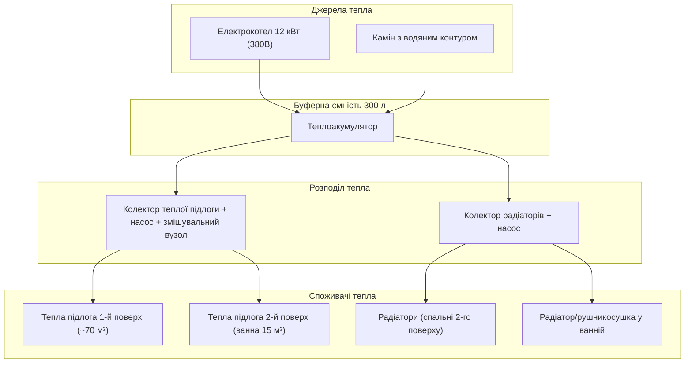
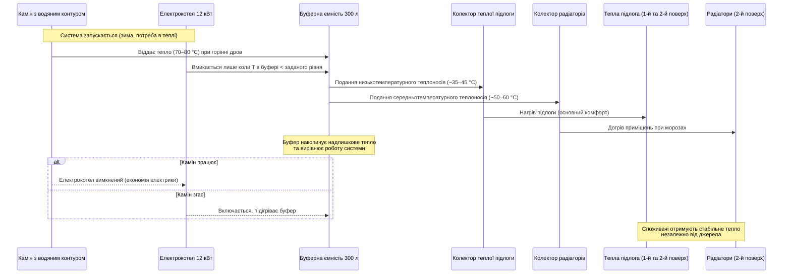
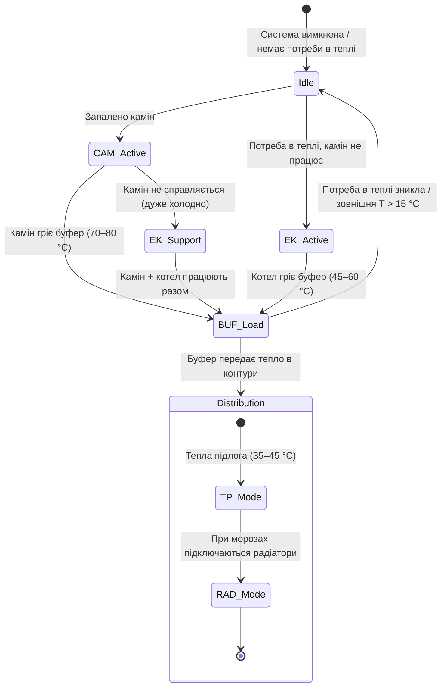
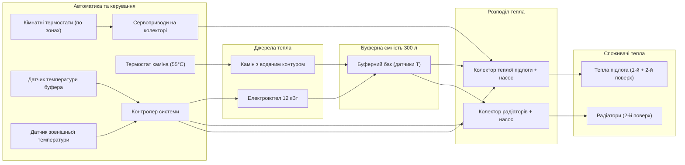

Чудово 👌
Ось **Mermaid схема системи опалення**: електрокотел + камін з водяним контуром + буферна ємність + контури теплої підлоги та радіаторів.

🔎 Пояснення:

* **EK** – електрокотел гріє буфер.
* **CAM** – камін із водяною сорочкою також віддає тепло в буфер.
* **BUF** – накопичує енергію та вирівнює температуру.
* **COL\_TP** – колектор теплої підлоги зі змішувальним вузлом (тримає низьку T \~35-45 °С).
* **COL\_RAD** – колектор радіаторів (подає вище T \~50-60 °С).
* **TP1, TP2, RAD1, RAD2** – споживачі тепла у приміщеннях.

---

Хочеш, я ще зроблю **Mermaid sequence diagram** (послідовність роботи: коли гріє камін, коли котел, як підключається буфер)?
## Проєкт опалення будинку 120 м² (електрокотел + тепла підлога + камін + буфер 300 л)
Добре 👍
Ось **Mermaid sequence diagram**, яка показує послідовність роботи системи опалення: камін, електрокотел, буфер та споживачі тепла.

📌 Логіка:

* Якщо горить камін → він гріє буфер, котел відключається.
* Якщо камін згас → котел підтримує температуру.
* Буфер віддає тепло в підлогу (низька T) та радіатори (середня T).

---

Хочеш, я підготую ще й **Mermaid state diagram** (стани системи: "Працює камін", "Працює котел", "Працюють разом", "Очікування")?

## Робоча схема
Супер 👍
Ось **Mermaid state diagram**, яка показує стани системи опалення (камін + електрокотел + буфер):

🔎 Пояснення станів:

* **Idle** – система в очікуванні, нічого не гріє.
* **CAM\_Active** – запущено камін, він гріє буфер.
* **EK\_Active** – камін не працює, електрокотел гріє буфер.
* **BUF\_Load** – буфер наповнюється теплом.
* **Distribution** – тепло від буфера розподіляється: спершу тепла підлога, при морозах додаються радіатори.
* **EK\_Support** – якщо мороз дуже сильний, камін + котел працюють разом.

---

Хочеш, я зроблю ще **Mermaid схему взаємозв’язків обладнання з автоматикою** (термостати, насоси, датчики)?

## автоматика

Чудово 👌
Ось **Mermaid схема взаємозв’язків обладнання та автоматики** для системи опалення (електрокотел + камін + буфер + підлога + радіатори).

📌 Логіка:

* **Кімнатні термостати (Tstat)** керують сервоприводами (ZV) на колекторі теплої підлоги → відкривають/закривають контури.
* **Термостат каміна (TCAM)** запускає насос каміна при досягненні 55 °C.
* **Датчик буфера (TBUF)** повідомляє контролеру, чи потрібно включати/вимикати котел.
* **Датчик зовнішньої температури (TOUT)** дозволяє реалізувати погодозалежне керування (економія).
* **Контролер (CTRL)** координує роботу котла, насосів і колекторів.

---

Хочеш, я підготую ще **список рекомендованих термостатів, насосів і автоматики середнього сегменту**, щоб було зрозуміло, що конкретно брати?

## Рекомендоване обладнання та автоматика
