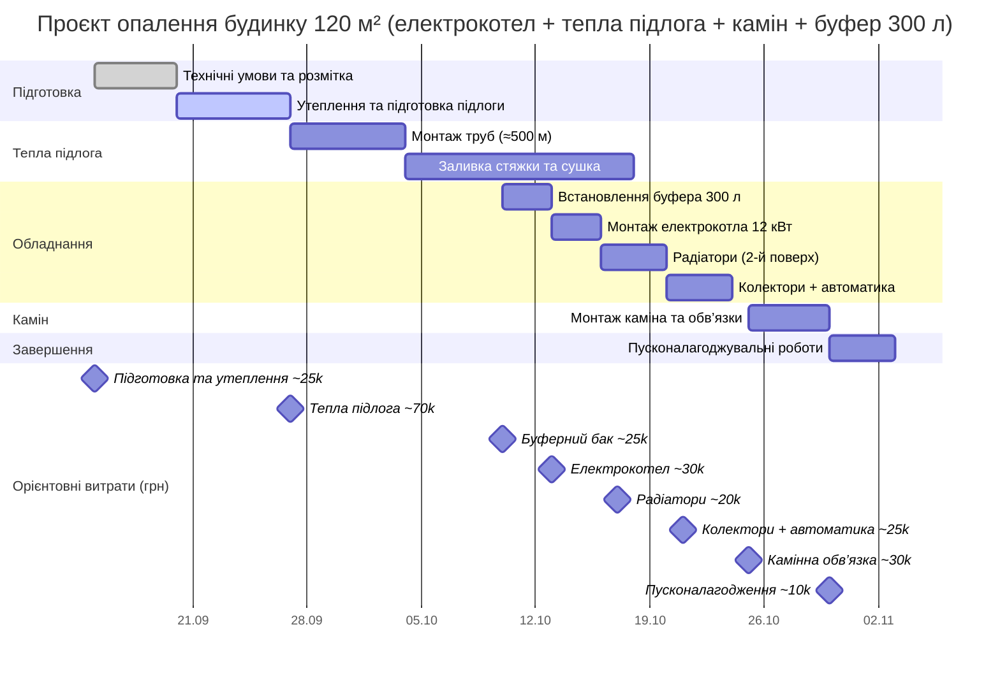

Добре 👌
Ось діаграма у форматі **Mermaid Gantt**, яка показує послідовність етапів робіт із приблизними витратами (середній сегмент).

📊 Ця діаграма показує:

* етапи й тривалість робіт;
* орієнтовну послідовність монтажу;
* контрольні точки з бюджетом по етапах.

Хочеш, я ще зроблю **Mermaid діаграму-схему системи опалення** (котел + камін + буфер + контури підлоги та радіаторів)?

## Автоматика та обладнання
Клас, ось стисла добірка **середнього сегмента**: що саме брати, навіщо, орієнтовні ціни й де подивитись характеристики/придбати.

# Термостати (кімнатні) та проводка під ТП

* **SALUS T105 / T105RF (дротовий/радіо)** — прості тижневі програмовані термостати для кімнат і зон ТП; у версії RF не треба тягнути дроти до колектора. Добре закривають більшість сценаріїв зонального керування. ([Manuals+][1])
* **SALUS KL08NSB (wiring center, 8 зон)** — «мозок» водяної теплої підлоги: підключення кімнатних термостатів, сервоприводів на колекторі, керування насосом і сигналом на котел. Ідеально для вашої схеми з кількома контурами. ([Salus][2])

# Контролери змішувального вузла / погодозалежка

* **TECH ST-431N (контролер 3-/4-ходового клапана + насос)** — керує змішувальним вузлом ТП, підтримує зв’язок із кімнатним термостатом та погодозалежний режим; стабільна «робоча конячка» для колекторної групи. ([kotly.com][3])

# Насоси циркуляційні (TP/радіатори/камінний контур)

* **Grundfos ALPHA2 25-60** — енергоефективний, «мокрий ротор», авто-режими, голова до \~6 м; універсальний вибір для колектора ТП та радіаторного контуру. ([E-каталог][4])
* **Wilo Yonos PICO 25/1-6** — альтернатива середнього класу з електронним регулюванням; добре стає на колектор чи радіатори. ([ukrinstal.com.ua][5])

# Змішувальні/захисні клапани

* **ESBE VTA (термостатичний змішувальний 20–43 °C або 35–60 °C)** — тримає низькотемпературний режим ТП (\~35–45 °C). Брати серію VTA3xx/VTA5xx під вашу гідравліку. ([atria-europe.com][6])
* **Laddomat 21-60 (завантажувальний вузол для каміна/твердопаливного контуру)** — швидкий прогрів сорочки каміна, захист від конденсації, правильне заряджання буфера; комплектний вузол із насосом. ([Mibec Trade][7])

# Колектори та «обв’язка» ТП

* **VALTEC колектор з витратомірами (6–8 контурів)** — надійна гребінка для балансування витрат; є готові комплекти з ротаметрами й запірною арматурою. ([VALTEC | Impianti sanitari affidabili][8])

---

## Орієнтовні ціни (UAH, вересень 2025) — середній сегмент

* Кімнатний термостат SALUS T105 / T105RF: **≈ 1 500–2 800** за зону (RF дорожчий). ([Manuals+][1])
* Центр керування ТП SALUS KL08NSB (8 зон): **≈ 4 500–6 500**. ([controls.com.ua][9])
* Контролер змішувального вузла TECH ST-431N: **≈ 6 500–8 500** (екв. €200). ([Foest.Europa®][10])
* Насос Grundfos ALPHA2 25-60: **≈ 7 500–10 500** (залежно від модифікації/постачальника). ([grundfos.com][11])
* Насос Wilo Yonos PICO 25/1-6: **≈ 8 000–9 500**. ([epicentrk.ua][12])
* Термостатичний змішувальний ESBE VTA: **≈ 3 800–5 500** (екв. €90–110). ([atria-europe.com][6])
* Laddomat 21-60 (вузол каміна → буфер): **≈ 12 000–16 000** (екв. £280–340). ([Mibec Trade][7])
* Колектор VALTEC з витратомірами (8 контурів): **≈ 9 000–13 000** (ціна сильно залежить від комплектації). ([VALTEC | Impianti sanitari affidabili][8])

> Примітка: курси/доставка дають розкид. Я взяв середину по ринку; за наявності конкретних продавців у Білогородці/Вишневому можна ще «притиснути» кошторис.

---

## Що саме поставити у вашій системі (рекомендація)

1. **ТП (1-й поверх + ванна 2-го):**
   KL08NSB (1 шт) + термостати SALUS по зонах (3–5 шт) + сервоприводи 230 В NC на колектор + ESBE VTA (40 °C) + насос Grundfos ALPHA2 25-60. ([Salus][2])
2. **Радіатори (2-й поверх):**
   Насос Wilo Yonos PICO 25/1-6 + стандартні термоголовки на радіаторах. ([epicentrk.ua][12])
3. **Камін з водяним контуром → буфер:**
   Laddomat 21-60 як «завантажувальний» вузол + термостат каміна на 55 °C (з насосом у складі вузла). ([Mibec Trade][7])
4. **Колектори:**
   VALTEC з витратомірами (8 виходів на 1-й поверх, 2–3 на 2-й під ванну/малий контур). ([VALTEC | Impianti sanitari affidabili][8])
5. **Автоматика змішувального вузла (опційно):**
   Якщо хочете погодозалежний режим — TECH ST-431N на трьохходовий клапан ТП. ([kotly.com][3])

Хочеш, зберу це все у зведену таблицю **«специфікація + кількість + ціна + підсумок»** саме під твій план (кількість зон/контурів), щоб можна було віддати підряднику як ТЗ?

[1]: https://manuals.plus/salus/t105rf-digital-programmable-thermostat-manual?utm_source=chatgpt.com "SALUS T105RF Digital Programmable Thermostat User ..."
[2]: https://saluscontrols.com/global/product/kl08nsb-wiring-centre-for-8-zones/?utm_source=chatgpt.com "KL08NSB Wiring centre, for 8 zones - SALUS Controls"
[3]: https://kotly.com/gb/55-mixing-valve-and-pump-controller-tech-st-431n-eu.html?utm_source=chatgpt.com "Mixing valve and pump controller TECH ST-431N EU"
[4]: https://e-catalog.com/GRUNDFOS-ALPHA2-25-60-180.htm?utm_source=chatgpt.com "Grundfos ALPHA2 25-60-180 6.2 m 1 1/2\" 180 mm"
[5]: https://ukrinstal.com.ua/ua/tsirkulyatsionnyy-nasos-wilo-yonos-pico1-0-25-1-6-130-row-4248085/?srsltid=AfmBOorRIrzGvJ6vd-6xRES2QC4RIegbT-Q39-85cVPmOqRMDjAnhinK&utm_source=chatgpt.com "Циркуляційний насос Wilo YONOS PICO1.0 25/1-6-130- ..."
[6]: https://www.atria-europe.com/thermostatic-mixing-valve-esbe-vta/?utm_source=chatgpt.com "Thermostatic mixing valve ESBE VTA"
[7]: https://trade.mibec.co.uk/product/laddomat-21-60-loading-valve/?utm_source=chatgpt.com "Laddomat 21 - 60 Loading Valve"
[8]: https://www.valtecsrl.com/eng/catalog/kollektornye_sistemy/kollektornye_bloki/kollektornyj_blok_so_vstroennymi_rashodomerami_vtc596emnx.html?utm_source=chatgpt.com "Manifold shut-off regulator kit with flow meters - VALTEC"
[9]: https://controls.com.ua/en/tsentr-komutatsii-8-zon-drotovyi-230v-salus-kl08nsb/?utm_source=chatgpt.com "Switching center for 8 zones Salus KL08NSB"
[10]: https://foest.eu/index.php?cPath=1_55_74&language=en&main_page=product_info&products_id=363&utm_source=chatgpt.com "Valve Controller EU-I-1 (ST-431N) (DE.100 V1)"
[11]: https://www.grundfos.com/content/dam/local/uk-ua/catalogues/_jcr_content1/%D0%9F%D1%80%D0%B0%D0%B9%D1%81%20%D0%BB%D0%B8%D1%81%D1%82%202025%20%D0%BD%D0%B0%20%D0%BF%D0%BE%D0%B1%D1%83%D1%82%D0%BE%D0%B2%D0%B5%20%D0%BE%D0%B1%D0%BB%D0%B0%D0%B4%D0%BD%D0%B0%D0%BD%D0%BD%D1%8F.pdf?utm_source=chatgpt.com "Прайс-лист"
[12]: https://epicentrk.ua/shop/wilo-yonos-pico-25-1-6-4215515.html?utm_source=chatgpt.com "ᐉ Wilo Yonos Pico 25/1-6 (4215515)"
## Зведена таблиця обладнання (приклад)
Добре 👍
Складу **зведену таблицю-специфікацію** для твого будинку (120 м², тепла підлога 1-й поверх + ванна 2-го, буфер 300 л, камін + електрокотел), у середньому ціновому сегменті.

---

# 📋 Специфікація обладнання та автоматики

| Компонент                                                            | Бренд / модель (приклад)             | Кількість | Орієнт. ціна за од., ₴ | Сума, ₴  |
| -------------------------------------------------------------------- | ------------------------------------ | --------- | ---------------------- | -------- |
| **Електрокотел 12 кВт (380 В)**                                      | Midea DSFB120BW / Kospel EKCO.L2M-12 | 1         | 22 000–30 000          | \~27 000 |
| **Буферна ємність 300 л (утеплена)**                                 | Apogey / Termico                     | 1         | 18 000–22 000          | \~20 000 |
| **Труба PEX-A 16×2 мм з EVOH**                                       | Valtec / Kan / Henco                 | \~500 м   | 50–60/м                | \~25 000 |
| **Утеплювач EPS 50 мм під ТП**                                       | Budmat / Technonikol                 | \~85 м²   | 230–250/м²             | \~20 000 |
| **Колектор з витратомірами (8 контурів)**                            | Valtec / Icma                        | 1         | 10 000–13 000          | \~12 000 |
| **Насос циркуляційний (ТП)**                                         | Grundfos ALPHA2 25-60                | 1         | 8 000–10 000           | \~9 000  |
| **Термостатичний змішувальний клапан**                               | ESBE VTA 322/522                     | 1         | 4 500–5 500            | \~5 000  |
| **Сервоприводи колектора (NC 230 В)**                                | Valtec / Salus                       | 6–8       | 500–600                | \~4 000  |
| **Центр керування ТП (wiring center)**                               | SALUS KL08NSB                        | 1         | 5 000–6 000            | \~5 500  |
| **Кімнатні термостати (по зонах)**                                   | SALUS T105 / T105RF                  | 4–5       | 1 800–2 200            | \~9 000  |
| **Насос для радіаторів**                                             | Wilo Yonos PICO 25/1-6               | 1         | 8 000–9 000            | \~8 500  |
| **Радіатори сталеві панельні**                                       | Korado / Prado                       | 4–5       | 3 000–4 000            | \~15 000 |
| **Термоголовки для радіаторів**                                      | Danfoss / Herz                       | 4–5       | 500–700                | \~2 500  |
| **Набір арматури (крани, фільтри, зворотні клапани, групи безпеки)** | Icma / Valtec                        | комплект  | \~10 000               | \~10 000 |
| **Камінна обв’язка (Laddomat 21-60 + насос)**                        | Laddomat / ESBE                      | 1         | 12 000–16 000          | \~14 000 |

---

# 💰 Підсумок

* **Разом обладнання + матеріали:** ≈ **186 500 ₴**
* **Монтажні роботи (укладання труб, стяжка, підключення, пусконалагодження):** ≈ **45 000–55 000 ₴**
* **Загалом (середній сегмент):** ≈ **230 000–240 000 ₴**

---

Ця таблиця вже готова як **технічне завдання для підрядника**:

* тут є перелік компонентів, бренди, кількість;
* вказані реалістичні ціни середнього рівня;
* підсумок співпадає з твоїм бюджетом.

📌 Якщо хочеш, я можу ще оформити це у **формат Excel/CSV** для зручності підрахунку чи коригування підрядником. Хочеш такий файл?
