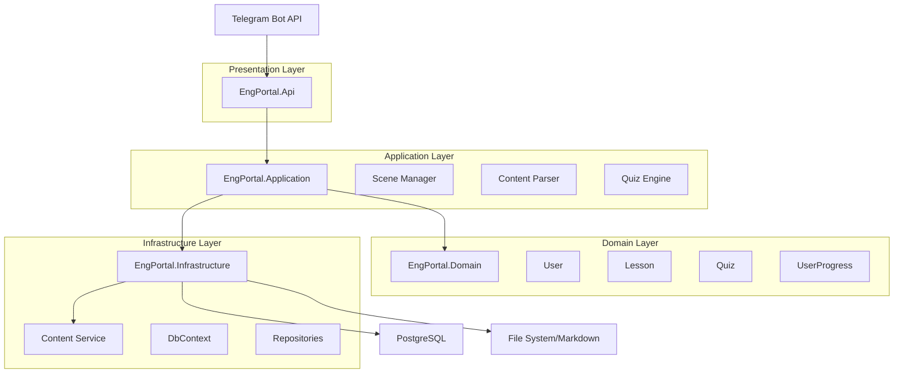
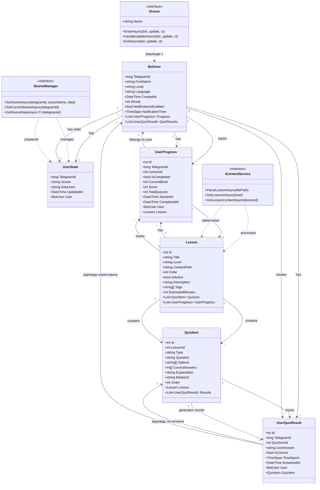
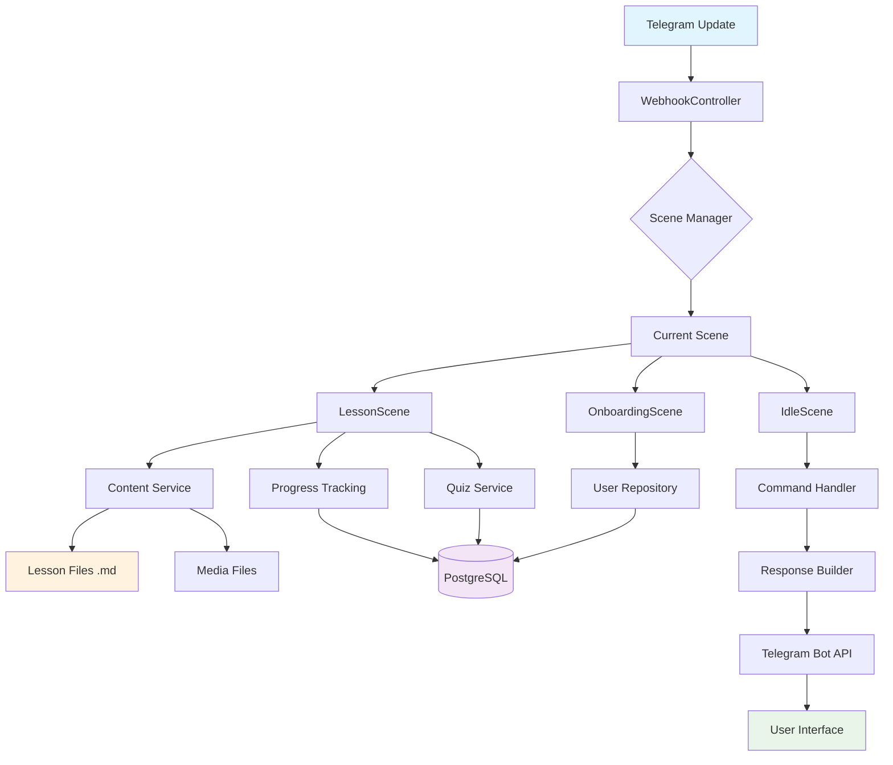
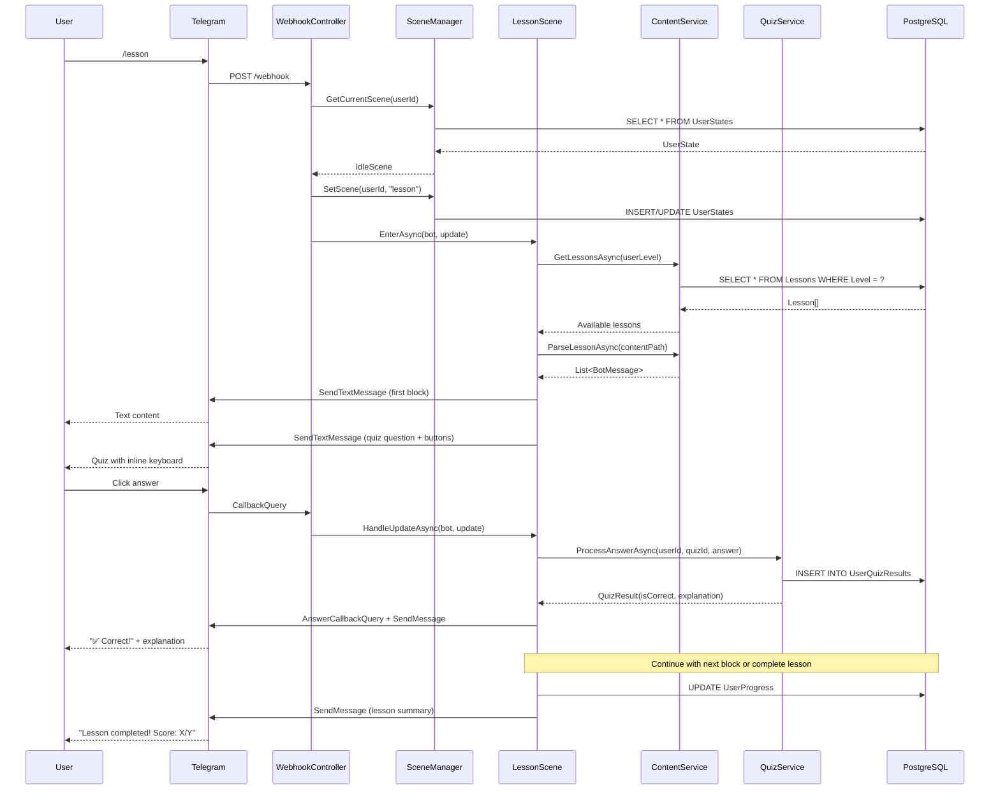
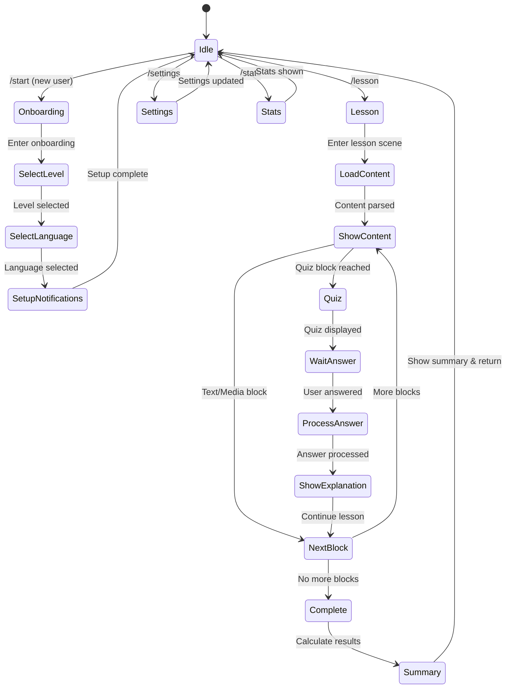

# Фінальний документ для реалізації Telegram-бота з навчання англійської (.NET 9)

---

## 📋 Огляд проєкту

**Мета:** створити Telegram-бота для вивчення англійської мови з використанням архітектури Clean Architecture на .NET 9, PostgreSQL та Docker.

**Основний функціонал MVP:**

- Сцена знайомства (вибір рівня A1/A2)
- Уроки з Markdown-контентом
- Система вікторин (3 типи: Flashcards, Multiple Choice, Typing)
- Трекінг прогресу користувача

---

## 📋 Таблиця контексту проєкту

| Аспект | Деталі | Технології/Інструменти |
|--------|--------|-------------------------|
| **Архітектура** | Clean Architecture (Presentation → Application → Domain → Infrastructure) | .NET 9, C# 12 |
| **База даних** | PostgreSQL з EF Core | Entity Framework Core 8, Npgsql |
| **UI/UX** | Telegram Bot API | Telegram.Bot SDK |
| **Контент** | Markdown файли з підтримкою медіа | Markdig, власний парсер |
| **Логування** | Структуроване логування | Serilog |
| **Контейнеризація** | Docker Compose | Docker, PostgreSQL 15 |
| **Вебхуки** | HTTPS webhook для Telegram | ASP.NET Core |
| **Локалізація** | Українська/Англійська | Resource файли |
| **Тестування** | Unit та Integration тести | xUnit, Moq |
| **CI/CD** | GitHub Actions | Docker, Azure DevOps |

| Компонент | Відповідальність | Залежності |
|-----------|------------------|------------|
| **EnglishBot.Api** | Webhook endpoint, DI конфігурація | Telegram.Bot, ASP.NET Core |
| **EnglishBot.Application** | Бізнес-логіка, сцени, сервіси | Domain, Infrastructure |
| **EnglishBot.Domain** | Доменні моделі, інтерфейси | - |
| **EnglishBot.Infrastructure** | БД, зовнішні сервіси, репозиторії | Domain, EF Core |

| Тип контенту | Формат | Обробка |
|-------------|--------|---------|
| **Текст** | Markdown з HTML | Markdig парсер |
| **Зображення** | JPG/PNG/WebP | Telegram Bot API |
| **Аудіо** | MP3/WAV | SendAudio метод |
| **Відео** | MP4 | SendVideo метод |
| **Вікторини** | :::quiz блоки | Власний парсер |

---

## 🏗️ Архітектура системи



---

## 📂 Структура проєктів

```css
EnglishBot/
├── EnglishBot.Api/             # Веб API + Webhook
├── EnglishBot.Application/     # Бізнес-логіка + Сцени
├── EnglishBot.Domain/          # Доменні моделі
├── EnglishBot.Content/         # Контент уроків
├── EnglishBot.Infrastructure/  # БД + Зовнішні сервіси
├── EnglishBot.Tests/           # Тести
└── docker-compose.yml          # Docker налаштування
```

---

## 🗂️ Схеми класів та їх взаємодія

### Діаграма взаємодії класів



### Діаграма потоку даних



### Domain Models

```csharp
namespace EnglishBot.Domain.Entities;

// Користувач бота
public class BotUser
{
    public long TelegramId { get; set; }
    public string? FirstName { get; set; }
    public string? Username { get; set; }
    public string Level { get; set; } = "A1"; // A1, A2, B1, B2
    public string Language { get; set; } = "uk"; // uk, en
    public DateTime CreatedAt { get; set; } = DateTime.UtcNow;
    public DateTime LastActivityAt { get; set; } = DateTime.UtcNow;
    public int Streak { get; set; }
    public bool NotificationsEnabled { get; set; } = true;
    public TimeSpan NotificationTime { get; set; } = TimeSpan.FromHours(9);
    
    // Navigation
    public List<UserProgress> Progress { get; set; } = new();
    public List<UserQuizResult> QuizResults { get; set; } = new();
}

// Стан користувача у боті
public class UserState
{
    public long TelegramId { get; set; }
    public string Scene { get; set; } = "idle"; // idle, onboarding, lesson, quiz
    public string? DataJson { get; set; } // Серіалізовані дані сцени
    public DateTime UpdatedAt { get; set; } = DateTime.UtcNow;
    
    // Navigation
    public BotUser User { get; set; } = default!;
}

// Урок
public class Lesson
{
    public int Id { get; set; }
    public string Title { get; set; } = default!;
    public string Level { get; set; } = "A1";
    public string ContentPath { get; set; } = default!; // Шлях до .md файлу
    public int Order { get; set; }
    public bool IsActive { get; set; } = true;
    public DateTime CreatedAt { get; set; } = DateTime.UtcNow;
    
    // Метадані
    public string? Description { get; set; }
    public string[]? Tags { get; set; }
    public int EstimatedMinutes { get; set; } = 15;
    
    // Navigation
    public List<QuizItem> Quizzes { get; set; } = new();
    public List<UserProgress> UserProgress { get; set; } = new();
}

// Питання вікторини
public class QuizItem
{
    public int Id { get; set; }
    public int LessonId { get; set; }
    public string Type { get; set; } = default!; // flashcard, mcq, typing
    public string Question { get; set; } = default!;
    public string[] Options { get; set; } = Array.Empty<string>();
    public int[] CorrectAnswers { get; set; } = Array.Empty<int>();
    public string? Explanation { get; set; }
    public string? MediaUrl { get; set; }
    public int Order { get; set; }
    
    // Navigation
    public Lesson Lesson { get; set; } = default!;
    public List<UserQuizResult> Results { get; set; } = new();
}

// Прогрес користувача по уроку
public class UserProgress
{
    public int Id { get; set; }
    public long TelegramId { get; set; }
    public int LessonId { get; set; }
    public bool IsCompleted { get; set; }
    public int CurrentBlock { get; set; } // Індекс поточного блоку у уроці
    public int Score { get; set; }
    public int TotalQuizzes { get; set; }
    public DateTime StartedAt { get; set; } = DateTime.UtcNow;
    public DateTime? CompletedAt { get; set; }
    
    // Navigation
    public BotUser User { get; set; } = default!;
    public Lesson Lesson { get; set; } = default!;
}

// Результат вікторини
public class UserQuizResult
{
    public int Id { get; set; }
    public long TelegramId { get; set; }
    public int QuizItemId { get; set; }
    public string UserAnswer { get; set; } = default!;
    public bool IsCorrect { get; set; }
    public TimeSpan TimeSpent { get; set; }
    public DateTime AnsweredAt { get; set; } = DateTime.UtcNow;
    
    // Navigation
    public BotUser User { get; set; } = default!;
    public QuizItem QuizItem { get; set; } = default!;
}
```

### Application Services

```csharp
namespace EnglishBot.Application.Services;

// Сервіс контенту
public interface IContentService
{
    Task<List<BotMessage>> ParseLessonAsync(string filePath);
    Task<Lesson[]> GetLessonsAsync(string level);
    Task<string> GetLessonContentAsync(int lessonId);
}

// Сцени бота
public interface IScene
{
    string Name { get; }
    Task EnterAsync(ITelegramBotClient bot, Update update, CancellationToken ct);
    Task HandleUpdateAsync(ITelegramBotClient bot, Update update, CancellationToken ct);
    Task ExitAsync(ITelegramBotClient bot, Update update, CancellationToken ct);
}

// Менеджер сцен
public interface ISceneManager
{
    Task SetSceneAsync(long telegramId, string sceneName, object? data = null);
    Task<IScene> GetCurrentSceneAsync(long telegramId);
    Task<T?> GetSceneDataAsync<T>(long telegramId) where T : class;
}

// Сервіс вікторин
public interface IQuizService
{
    Task<QuizResult> ProcessAnswerAsync(long telegramId, int quizId, string answer);
    Task<QuizStatistics> GetUserStatisticsAsync(long telegramId);
}

// Типи повідомлень для контенту
public abstract record BotMessage;
public record TextMessage(string Content, string? ParseMode = null) : BotMessage;
public record PhotoMessage(string Caption, string ImagePath) : BotMessage;
public record AudioMessage(string Caption, string AudioPath) : BotMessage;
public record VideoMessage(string Caption, string VideoPath) : BotMessage;
public record QuizMessage(
    string Question, 
    string[] Options, 
    int[] CorrectAnswers, 
    string? Explanation,
    string Type = "mcq"
) : BotMessage;
```

### Діаграма взаємодії компонентів під час виконання уроку



### Діаграма стану користувача



---

## 🎯 Псевдокод основних сцен

### OnboardingScene

```csharp
public class OnboardingScene : IScene
{
    private record OnboardingData(string Step, string? Level = null, string? Language = null);
    
    public async Task EnterAsync(ITelegramBotClient bot, Update update, CancellationToken ct)
    {
        var chatId = GetChatId(update);
        await bot.SendTextMessageAsync(chatId, 
            "🎯 Привіт! Я допоможу тобі вивчити англійську.\n" +
            "Спочатку оберемо твій рівень:",
            replyMarkup: CreateLevelKeyboard());
            
        await _sceneManager.SetSceneDataAsync(GetUserId(update), 
            new OnboardingData("select_level"));
    }
    
    public async Task HandleUpdateAsync(ITelegramBotClient bot, Update update, CancellationToken ct)
    {
        var data = await _sceneManager.GetSceneDataAsync<OnboardingData>(GetUserId(update));
        
        switch (data?.Step)
        {
            case "select_level":
                await HandleLevelSelection(bot, update, ct);
                break;
            case "select_language":
                await HandleLanguageSelection(bot, update, ct);
                break;
            case "setup_notifications":
                await HandleNotificationSetup(bot, update, ct);
                break;
        }
    }
    
    private async Task HandleLevelSelection(ITelegramBotClient bot, Update update, CancellationToken ct)
    {
        if (update.CallbackQuery?.Data?.StartsWith("level:") == true)
        {
            var level = update.CallbackQuery.Data.Split(':')[1];
            var chatId = update.CallbackQuery.Message!.Chat.Id;
            
            await bot.SendTextMessageAsync(chatId, 
                "🌍 Тепер оберемо мову інтерфейсу:",
                replyMarkup: CreateLanguageKeyboard());
                
            await _sceneManager.SetSceneDataAsync(GetUserId(update), 
                new OnboardingData("select_language", level));
        }
    }
    
    // ... інші методи
}
```

### LessonScene

```csharp
public class LessonScene : IScene
{
    private record LessonData(
        int LessonId,
        List<BotMessage> Blocks,
        int CurrentIndex,
        int Score,
        DateTime StartTime);
    
    public async Task EnterAsync(ITelegramBotClient bot, Update update, CancellationToken ct)
    {
        var userId = GetUserId(update);
        var user = await _userRepository.GetByTelegramIdAsync(userId);
        
        // Отримуємо доступні уроки для рівня користувача
        var lessons = await _contentService.GetLessonsAsync(user.Level);
        var currentLesson = lessons.FirstOrDefault(l => !IsCompleted(userId, l.Id));
        
        if (currentLesson == null)
        {
            await bot.SendTextMessageAsync(GetChatId(update), 
                "🎉 Ти завершив усі доступні уроки! Переходь на наступний рівень.");
            await _sceneManager.SetSceneAsync(userId, "idle");
            return;
        }
        
        // Парсимо контент уроку
        var blocks = await _contentService.ParseLessonAsync(currentLesson.ContentPath);
        var data = new LessonData(currentLesson.Id, blocks, 0, 0, DateTime.UtcNow);
        
        await _sceneManager.SetSceneDataAsync(userId, data);
        await ProcessNextBlock(bot, update, ct, data);
    }
    
    private async Task ProcessNextBlock(ITelegramBotClient bot, Update update, 
        CancellationToken ct, LessonData data)
    {
        if (data.CurrentIndex >= data.Blocks.Count)
        {
            await CompleteLessonAsync(bot, update, ct, data);
            return;
        }
        
        var currentBlock = data.Blocks[data.CurrentIndex];
        var chatId = GetChatId(update);
        
        switch (currentBlock)
        {
            case TextMessage text:
                await bot.SendTextMessageAsync(chatId, text.Content, 
                    parseMode: text.ParseMode);
                await MoveToNextBlock(bot, update, ct, data);
                break;
                
            case QuizMessage quiz:
                await SendQuizAsync(bot, chatId, quiz, ct);
                break;
                
            case PhotoMessage photo:
                await bot.SendPhotoAsync(chatId, 
                    InputFile.FromUri(photo.ImagePath), 
                    caption: photo.Caption);
                await MoveToNextBlock(bot, update, ct, data);
                break;
                
            // ... інші типи повідомлень
        }
    }
    
    private async Task SendQuizAsync(ITelegramBotClient bot, long chatId, 
        QuizMessage quiz, CancellationToken ct)
    {
        var keyboard = new InlineKeyboardMarkup(
            quiz.Options.Select((option, index) => 
                new[] { InlineKeyboardButton.WithCallbackData(option, $"quiz:{index}") })
        );
        
        await bot.SendTextMessageAsync(chatId, 
            $"❓ {quiz.Question}", 
            replyMarkup: keyboard);
    }
    
    public async Task HandleUpdateAsync(ITelegramBotClient bot, Update update, CancellationToken ct)
    {
        if (update.CallbackQuery?.Data?.StartsWith("quiz:") == true)
        {
            await HandleQuizAnswerAsync(bot, update, ct);
        }
    }
    
    private async Task HandleQuizAnswerAsync(ITelegramBotClient bot, Update update, CancellationToken ct)
    {
        var data = await _sceneManager.GetSceneDataAsync<LessonData>(GetUserId(update));
        var selectedOption = int.Parse(update.CallbackQuery!.Data!.Split(':')[1]);
        var quiz = (QuizMessage)data!.Blocks[data.CurrentIndex];
        
        var isCorrect = quiz.CorrectAnswers.Contains(selectedOption);
        var newScore = isCorrect ? data.Score + 1 : data.Score;
        
        // Відповідь користувачеві
        await bot.AnswerCallbackQueryAsync(update.CallbackQuery.Id,
            isCorrect ? "✅ Правильно!" : "❌ Неправильно");
            
        // Пояснення (якщо є)
        if (!string.IsNullOrEmpty(quiz.Explanation))
        {
            await bot.SendTextMessageAsync(GetChatId(update), 
                $"{(isCorrect ? "✅" : "❌")} {quiz.Explanation}");
        }
        
        // Зберігаємо результат
        await SaveQuizResultAsync(GetUserId(update), selectedOption, isCorrect);
        
        // Переходимо до наступного блоку
        var updatedData = data with { Score = newScore, CurrentIndex = data.CurrentIndex + 1 };
        await _sceneManager.SetSceneDataAsync(GetUserId(update), updatedData);
        await ProcessNextBlock(bot, update, ct, updatedData);
    }
}
```

---

## 📅 Етапи реалізації

### Етап 1: Основна інфраструктура (Тиждень 1-2)

**Завдання:**

- [ ] Створення структури проєктів (.NET 9)
- [ ] Налаштування EF Core + PostgreSQL
- [ ] Створення доменних моделей
- [ ] Базова конфігурація Docker Compose
- [ ] Реалізація SceneManager та базових сцен
- [ ] Налаштування Serilog для логування
- [ ] Створення webhook endpoint для Telegram

**Критерії готовності:**

- Бот отримує та обробляє базові команди
- БД створюється та заповнюється початковими даними
- Логи пишуться у консоль та файл
- Docker контейнери запускаються без помилок

### Етап 2: Сцена знайомства (Тиждень 3)

**Завдання:**

- [ ] Реалізація OnboardingScene
- [ ] Створення inline-клавіатур для вибору рівня
- [ ] Збереження користувацьких налаштувань у БД
- [ ] Валідація введених даних
- [ ] Локалізація повідомлень (українська/англійська)

**Критерії готовності:**

- Нові користувачі проходять повну процедуру знайомства
- Налаштування зберігаються у БД
- Інтерфейс доступний українською та англійською

### Етап 3: Система контенту (Тиждень 4)

**Завдання:**

- [ ] Реалізація ContentService для парсингу Markdown
- [ ] Підтримка різних типів контенту (текст, зображення, аудіо)
- [ ] Система :::quiz блоків у markdown
- [ ] Завантаження та кешування медіафайлів
- [ ] Створення шаблонів уроків

**Критерії готовності:**

- Markdown файли корректно парсяться у BotMessage
- Медіафайли відправляються у Telegram
- Вікторини з markdown працюють

### Етап 4: Система вікторин (Тиждень 5)

**Завдання:**

- [ ] Реалізація 3 типів вікторин (MCQ, Flashcards, Typing)
- [ ] LessonScene з підтримкою mixed-контенту
- [ ] Збереження результатів у UserQuizResult
- [ ] Система оцінювання та прогресу
- [ ] Статистика користувача

**Критерії готовності:**

- Усі типи вікторин працюють коректно
- Результати зберігаються у БД
- Користувач бачить свій прогрес

### Етап 5: Додаткові функції (Тиждень 6)

**Завдання:**

- [ ] Система нагадувань (щоденні повідомлення)
- [ ] Команди /stats, /progress, /help
- [ ] Система стріків (consecutive days)
- [ ] Backup/restore користувацьких даних
- [ ] Обробка помилок та Rate Limiting

**Критерії готовності:**

- Нагадування працюють за розкладом
- Статистика відображається коректно
- Система обробляє помилки gracefully

---

## 🚀 Інструкції для розгортання

### Локальна розробка

```bash
# 1. Клонування репозиторію
git clone <repository-url>
cd EnglishBot

# 2. Запуск БД через Docker
docker-compose up -d postgres

# 3. Застосування міграцій
dotnet ef database update --project EnglishBot.Infrastructure --startup-project EnglishBot.Api

# 4. Налаштування appsettings.json
# Додати BOT_TOKEN, WEBHOOK_SECRET, connection string

# 5. Запуск проєкту
dotnet run --project EnglishBot.Api
```

### Продакшн (Docker)

```yaml
# docker-compose.prod.yml
version: '3.8'
services:
  app:
    build: .
    environment:
      - ASPNETCORE_ENVIRONMENT=Production
      - ConnectionStrings__Default=Host=postgres;Database=englishbot;Username=postgres;Password=${DB_PASSWORD}
      - Bot__Token=${BOT_TOKEN}
      - Bot__WebhookSecret=${WEBHOOK_SECRET}
    depends_on:
      - postgres
    
  postgres:
    image: postgres:15
    environment:
      - POSTGRES_DB=englishbot
      - POSTGRES_PASSWORD=${DB_PASSWORD}
    volumes:
      - postgres_data:/var/lib/postgresql/data

volumes:
  postgres_data:
```

---

## 📊 Метрики успіху MVP

- **Технічні:**
  - Бот обробляє 95%+ повідомлень без помилок
  - Час відповіді < 2 секунд
  - Uptime > 99%

- **Функціональні:**
  - Користувач може пройти повний цикл: знайомство → урок → вікторини → результат
  - Прогрес зберігається між сеансами
  - Система підтримує мінімум 10 одночасних користувачів

- **UX:**
  - Інтуїтивна навігація без зайвих кроків
  - Швидкий фідбек на дії користувача
  - Зрозумілі повідомлення про помилки

---

**Готово!** Цей документ містить усе необхідне для початку реалізації Telegram-бота для навчання англійської мови. Можна починати з першого етапу та поступово розширювати функціонал.
