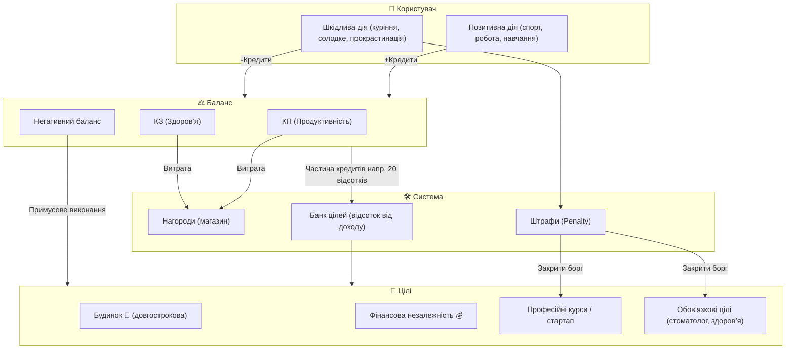

# Система винагороджень

```mermaid
flowchart TD
    subgraph User["👤 Користувач"]
        A1["Позитивна дія (спорт, робота, навчання)"]
        A2["Шкідлива дія (куріння, солодке, прокрастинація)"]
    end

    subgraph Balance["⚖️ Баланс"]
        B1["КП (Продуктивність)"]
        B2["КЗ (Здоров’я)"]
        B3["Негативний баланс"]
    end

    subgraph Goals["🎯 Цілі"]
        G1["Будинок 🏡 (довгострокова)"]
        G2["Фінансова незалежність 💰"]
        G3["Професійні курси / стартап"]
        G4["Обов'язкові цілі (стоматолог, здоров’я)"]
    end

    subgraph System["🛠️ Система"]
        R1["Нагороди (магазин)"]
        P1["Штрафи (Penalty)"]
        S1["Банк цілей (відсоток від доходу)"]
    end

    %% Flows
    A1 -->|+Кредити| Balance
    A2 -->|-Кредити| Balance

    Balance -->|Частина кредитів напр. 20 відсотків| S1
    S1 --> Goals

    A2 --> P1
    P1 -->|Закрити борг| G3
    P1 -->|Закрити борг| G4

    B1 -->|Витрата| R1
    B2 -->|Витрата| R1

    B3 -->|Примусове виконання| Goals
```
