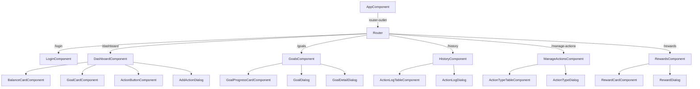

# Флоу користувача

```mermaid
flowchart TD

App[AppComponent] -->|router-outlet| R[Router]

%% Routes
R -->|"/login"| Login[LoginComponent]
R -->|"/dashboard"| Dashboard[DashboardComponent]
R -->|"/goals"| Goals[GoalsComponent]
R -->|"/history"| History[HistoryComponent]
R -->|"/manage-actions"| ManageActions[ManageActionsComponent]
R -->|"/rewards"| Rewards[RewardsComponent]

%% Dashboard
Dashboard --> BalanceCard[BalanceCardComponent]
Dashboard --> GoalCard[GoalCardComponent]
Dashboard --> QuickActionBtn[ActionButtonComponent]
Dashboard --> AddActionDialog[AddActionDialog]

%% Goals
Goals --> GoalCardList[GoalProgressCardComponent]
Goals --> GoalDialog[GoalDialog]
Goals --> GoalDetailDialog[GoalDetailDialog]

%% Manage Actions
ManageActions --> ActionTypeTable[ActionTypeTableComponent]
ManageActions --> ActionTypeDialog[ActionTypeDialog]

%% Rewards
Rewards --> RewardCard[RewardCardComponent]
Rewards --> RewardDialog[RewardDialog]

%% History
History --> ActionLogTable[ActionLogTableComponent]
History --> ActionLogDialog[ActionLogDialog]

```
