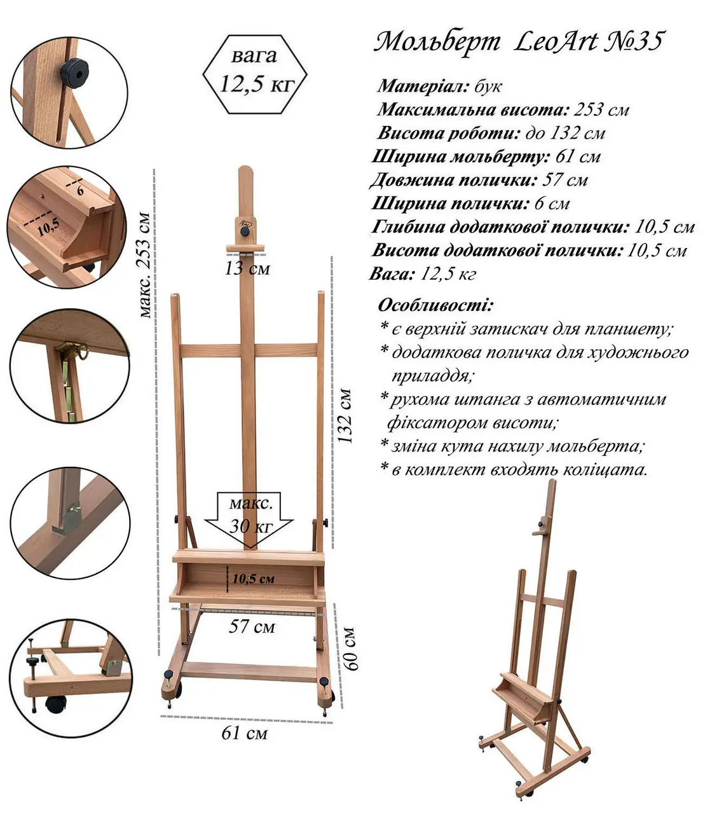

# Студійний мольберт — інструкція (MD)

Нижче — повний набір для самостійного виготовлення: розкрій деталей, точки кріплення, список фурнітури та прості текстові схеми (вид спереду / збоку / згори). Розміри підігнані під модель на фото з урахуванням вашого ТЗ.

> Одиниці — **мм** (інакше зазначено). Допуски ±1–2 мм для деревини, ±0.5 мм для отворів.
> Базові перерізи: рама/стіойки **20×40**, основа **40×60** (60 мм — висота).

---

## 1 Розкрій деревини (cut-list)

| №  |                          Деталь | К-сть | Переріз |   Довжина | Примітка                        |
| -- | ------------------------------: | ----: | ------: | --------: | ------------------------------- |
| 1  |           Стійка передня (ліва) |     1 |   20×40 |      1530 | Паз 10×1000 (див. §3)           |
| 2  |          Стійка передня (права) |     1 |   20×40 |      1530 | Паз 10×1000                     |
| 3  |                Перемичка верхня |     1 |   20×40 |       570 | Внутрішня ширина рами = **570** |
| 4  |               Перемичка середня |     1 |   20×40 |       570 | Жорсткість                      |
| 5  |          Каретка (опорна дошка) |     1 |   20×60 |       570 | Довжина **57 см**               |
| 6  |       Поличка-бортик на каретці |     1 |   20×40 |       570 | Корисна ширина полиці 60        |
| 7  |  Додаткова полиця (лоток) — дно |     1 |  12×570 |       570 | Мат. 10–12 мм                   |
| 8  | Додаткова полиця (лоток) — боки |     2 |  12×105 |       105 | **105×105 мм** (г×в)            |
| 9  |              Щогла (подовжувач) |     1 |   20×40 | 1000–1200 | Підігнати під полотна           |
| 10 |       Слайдер під верхній зажим |     1 |   20×40 |       130 | Отвір/проріз (див. §3)          |
| 11 |            Підпірна тяга (ліва) |     1 |   20×30 |       720 | Шарніри М8                      |
| 12 |           Підпірна тяга (права) |     1 |   20×30 |       720 |                                 |
| 13 |           Основа: брус передній |     1 |   40×60 |       610 | Зовн. ширина **61 см**          |
| 14 |             Основа: брус задній |     1 |   40×60 |       610 |                                 |
| 15 |            Основа: брус боковий |     2 |   40×60 |       600 | Глибина **60 см**               |

> Якщо є брус 22×45 — можна використати; зовнішня ширина збільшиться на \~+10 мм (некритично).

---

## 2 Фурнітура та кріплення (що купити)

**Обов’язково**

* Колісні опори Ø50–75 мм з гальмом — **4 шт**, гвинт **M8×40** + шайби.
* Гайки-баранці **M8** — **6 шт** (каретка ×2, верхній зажим ×1, запас ×3).
* Болти **M8×60–70** — **4 шт** (каретка ×2, верхній зажим ×1, запас ×1).
* Шайби Ø8 великі — **10–12 шт** (під пази та зажим).
* Металеві кутики 40×40×2 мм — **4 шт** (кріплення стійок до основи).
* Шарніри/осьові болти для тяг **M8×50** + гайки самоконтр. — **4 шт**.
* Механізм нахилу типу «драбинка/тріскачка» — **2 шт** (довжина 300–350 мм, крок 30 мм).
* Стяжні гвинти по дереву 5×60 — **прибл. 30 шт**.
* Клей ПВА D3, наждак P120–P240, олія/лак.

**Опційно**

* Рівняльні ніжки/шпильки **M10** з гайкою-барашком — **2 шт** (передні кути).
* Латунні/фторопластові накладки тертя для пазів — **2 шт**.

---

## 3 Точки кріплення та отвори

### 3.1. Пази у стійках (під каретку)

* **Ширина пазу:** 10 мм.
* **Довжина:** **1000 мм**.
* **Відступ від внутрішнього краю стійки:** 10 мм до осі пазу.
* **Початок пазу:** **180 мм** від низу стійки (від площини верху основи).
* **Отвори в каретці:** 2 шт Ø8.5, **вертикальний крок 80 мм** між осями, на відступі 25 мм від верхньої кромки каретки.

### 3.2. Каретка + полиця

* Каретка (№5) кріпиться до стійок **через пази** болтами **M8×60** з великими шайбами Ø30.
* Поличка-бортик (№6) прикручується зверху до каретки 4–6 шурупами 4×45.
* Лоток 570×105×105 (№7–8) кріпиться знизу каретки 6–8 шурупами 4×35.

### 3.3. Верхній зажим

* Слайдер (№10) 130 мм із **овальним прорізом 15×60 мм** по центру.
* Болт **M8×70** проходить через проріз і притискає полотно до щогли (№9).
* Відстань від верхнього торця слайдера до центру майданчика притиску — **40 мм**.

### 3.4. Підпірні тяги та «драбинка» нахилу

* **Верхні шарніри тяг** — на стійках: **500 мм** від низу стійки до осі болта M8.
* **Нижні шарніри** — на бокових брусах основи: **120 мм** від заднього зовнішнього краю вперед; **центрувати** по ширині бруса (30 мм від країв).
* «Драбинка»/планка фіксації нахилу ставиться біля верхнього шарніра; **перший щабель \~70 мм** нижче осі шарніра; **крок 30 мм**; діапазон кутів \~80–100° до горизонту.

### 3.5. Стійки ↔ основа

* Стійки ставимо на бокові бруси основи, центруючи по ширині бруса 60 мм.
* Кутики 40×40×2 — по **2 шт на стійку** (по одному спереду/ззаду), гвинти 5×40 у дерево.

### 3.6. Колеса / планка для ніжок

* Колеса в кутах: отвір Ø8 **по центрах торців**, відступ 35 мм від кромок.
* Якщо додаєте передні ніжки-«стопори»: свердління Ø10 на **60 мм** від передніх країв та **30 мм** від бокових.

---

## 4 Прості текстові схеми

### 4.1 Вид спереду

```
   ↑
  2530 (макс із щоглою)     ┌─ верхній зажим 130 ─┐
                            │        ┃ щогла      │
  1530 (висота стійок)   ┌──┴────────┻───────────┴──┐
                         │        верхня перемичка   │  ← 570
                         │                           │
                         │        (внутр. просвіт)   │
                         │                           │
                         │——— середня перемичка ————│
                         │                           │
                         │====== полиця/каретка =====│  ← 570
                         │     (2 болти М8 у пазах)  │
                         │                           │
                         └─────────┬───────┬─────────┘
                                   │       │
                                   │       │
                                   ▼       ▼
                            підпірні тяги (шарніри М8)
   ───────────────────────────────────────────────────→  610 (ширина основи)
```

### 4.2 Вид збоку (ліва)

```
        ↑
        │           стійка 1530
        │             │
    500 │   ● верхній шарнір тяги (М8)
        │    ╲            «драбинка» 300–350 (крок 30)
        │     ╲
        │      ╲  тяга 720
        │       ╲
        │        ● нижній шарнір (М8) — 120 мм від зад. краю основи
        │
        │  ── полиця/каретка (рух у пазі 1000 мм, старт 180 мм від низу)
        │
        └──────────────────────────────────────────→  600 (глибина основи)
       [перед]                                   [зад]
```

### 4.3 Вид згори

```
         610 (загальна ширина)
     ┌───────────────────────────────────┐
  60 │◄──────────── основа ───────────► │
     │  ┌───── стійка ─────┐  ┌─────┐   │
     │  │                  │  │     │   │
     │  │      просвіт 570 │  │     │   │
     │  │                  │  │     │   │
     │  └──────────────────┘  └─────┘   │
     │        (каретка 570)             │
     └───────────────────────────────────┘
             600 (загальна глибина)
```

---

## 5 Порядок складання (коротко)

1. **Основа 610×600.** Збираємо прямокутник (13–15), ставимо колеса; перевіряємо прямокутність (діагоналі).
2. **Стійки.** Кріпимо до основи кутиками; перевіряємо вертикаль рівнем.
3. **Перемички 570.** Верхню та середню — на шурупи + клей.
4. **Пази.** Фрезеруємо/свердлимо паз 10×1000 у кожній стійці (старт 180 від низу).
5. **Каретка + полиця + лоток.** Збираємо модуль, ставимо болти М8 з шайбами.
6. **Тяги та «драбинка».** Свердлимо точки під шарніри (див. §3.4), ставимо планки-щаблі.
7. **Щогла, слайдер, зажим.** Проріз 15×60 у слайдері, болт М8×70 з баранцем.
8. **Шліф/фініш.** P120→P240, фініш олія/лак. Перевіряємо плавність ходу каретки та фіксацію кутів.

---

## 6 Контрольні розміри

* **Зовнішня ширина мольберта:** 610 мм.
* **Глибина основи:** 600 мм.
* **Внутрішній просвіт між стійками:** **570 мм** (під полицю 570).
* **Висота роботи (каретка вгорі):** ≈ 1320 мм (за ТЗ).
* **Максимальна висота з щоглою:** до **2530 мм** (за ТЗ; підігнати довжину щогли).
* **Навантаження:** до **30 кг** (орієнтир для бруса 20×40 з бука).

---

## 7 Поради

* Щоб каретка ковзала м’яко, поставте **тонкі латунні/фторопластові накладки** або великі шайби між баранцем і деревом.
* Для «драбинки» добре працює латунь/оцинкована сталь 2–3 мм завтовшки.
* Якщо плануєте **полотна >140 см**, підсиліть стійки на **22×45** і збільшіть каретку до **20×70**.

---


