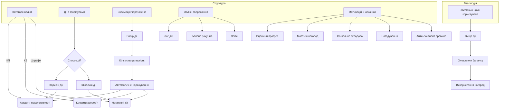

Супер 👍
Зробимо **загальну концепцію системи обліку кредитів**, яка може працювати в будь-якому середовищі (Telegram, мобільний додаток, веб, навіть папір із QR-кодами).

---

# 💠 Концепція системи кредитів

## 1. Ключові елементи

1. **Категорії валют**

   * ⚡ **Кредити продуктивності (КП)**
   * 💚 **Кредити здоров’я (КЗ)**
   * 🚫 **Штрафи / негативні дії**

2. **Дії з чіткими формулами**

   * Усі корисні й шкідливі дії мають **готовий список + фіксовані коефіцієнти**.
   * Напр.: *«Робоча сесія 30 хв = +30 КП»* чи *«1 сигарета = −8 КЗ»*.

3. **Взаємодія через меню вибору**

   * Користувач не вводить числа — лише обирає дію.
   * Додатковий крок (якщо потрібно) → кількість/тривалість.
   * Система сама нараховує/знімає кредити.

4. **Облік і збереження даних**

   * Лог кожної дії (дата, категорія, кількість, результат).
   * Баланс двох рахунків (КП і КЗ).
   * Можливість формувати щотижневі й щомісячні підсумки.

---

## 2. Способи взаємодії (платформо-незалежно)

* **Меню категорій** → вибір виду діяльності → підтвердження → автоматичне нарахування.
* **Баланс** → миттєвий перегляд (наприклад, окремим екраном чи кнопкою).
* **Звітність** → денна, тижнева, місячна (графік чи список дій).
* **Магазин нагород** → список бонусів, які можна «купити» за кредити.
* **Челенджі та цілі** → користувач може активувати виклик (наприклад, 100 віджимань на тиждень).

---

## 3. Мотиваційні механіки (щоб дотримуватись системи)

1. **Видимий прогрес**

   * Баланс у реальному часі.
   * Відображення streak (послідовність днів).
   * Рівні/титули (Новачок → Майстер → Архітектор → Гранд).

2. **Магазин нагород**

   * Нагороди за кредити (маленькі, середні, великі).
   * Частина нагород «здорова» (смаколики, відпочинок), частина «продуктивна» (додатковий вихідний, привілей вибору фільму).

3. **Соціальна складова**

   * Паралельне використання двома людьми (як у тебе з дружиною).
   * Можливість «переказати кредити» партнеру чи накопичувати у спільний банк.

4. **Автоматичні нагадування**

   * М’які пінги: «Ти ще не додав активність сьогодні, а вже 20:00».
   * Позитивні: «🔥 Ти вже заробив 100 КП цього тижня!».

5. **Анти-експлойт правила**

   * Мінімальна сесія: ≥15 хв.
   * Обмеження на кількість кредитів на день.
   * Штрафи, які не можна скасувати (тільки «джокером» раз на тиждень).

---

## 4. Приклад життєвого циклу користувача

1. Вранці відкриває систему → обирає «Сон 00–08 → +20 КЗ».
2. Під час роботи запускає таймер → після 30 хв тисне «Робоча сесія → +30 КП».
3. Увечері записує тренування: «Віджимання 30 раз → +30 КЗ».
4. Випив газованої + шоколад → «Солодке → −3 КЗ».
5. Баланс показує: КП = 60, КЗ = 47.
6. У «магазині нагород» купує «Вечір фільму → −40 КП».

---

## 5. Узагальнена структура

* **Категорії дій** → підкатегорії → опції кількості.
* **Баланс** (два рахунки: КП і КЗ).
* **Лог** (список дій із датами).
* **Звіти** (день/тиждень/місяць).
* **Нагороди** (магазин + рівні).
* **Мотиваційні механіки** (streak, нагадування, спільний банк).

# Kaizen Credit System Concept Diagram

