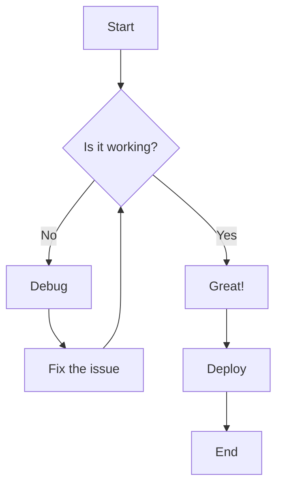
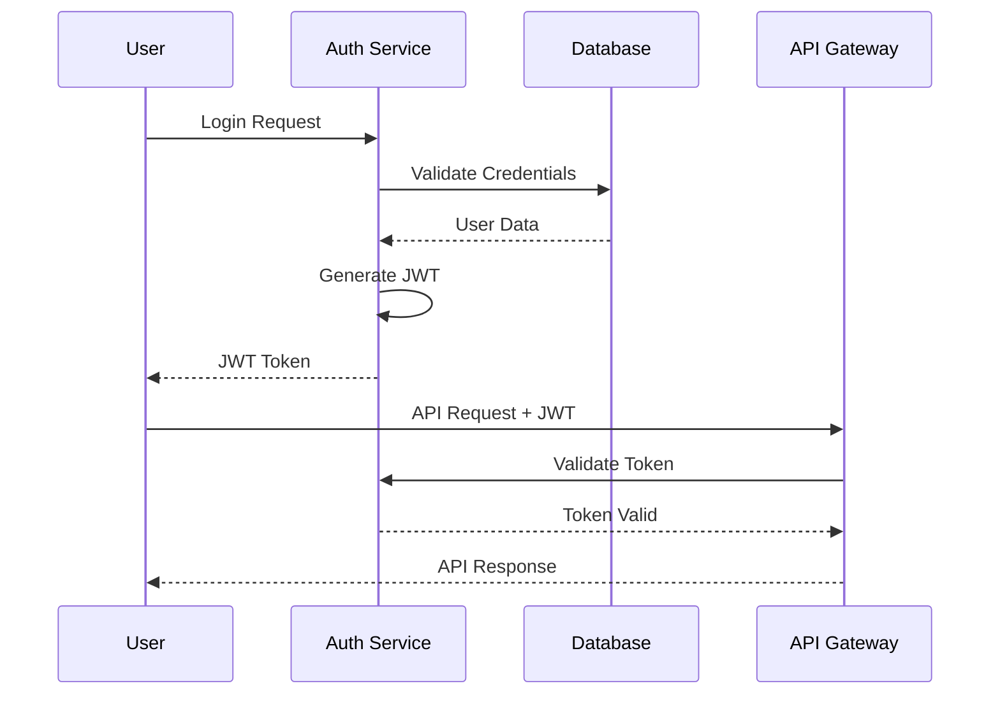
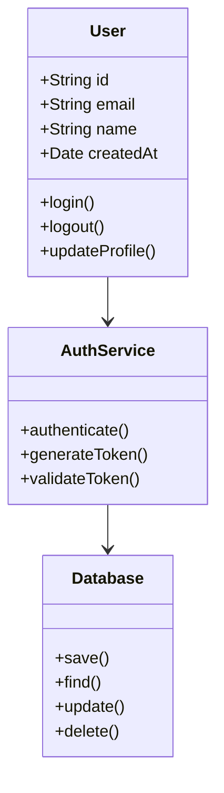

# Markdown Feature Showcase

This page demonstrates all the markdown features supported by the documentation portal, including text formatting, code blocks, mathematical formulas, diagrams, tables, images, and links.

## Text Formatting

### Basic Formatting
- **Bold text** and *italic text*
- ~~Strikethrough text~~
- `Inline code`
- Regular text with **mixed** *formatting* and `code`

### Headers
Different header levels are demonstrated throughout this document.

#### Subsection Example
##### Deep Subsection
###### Deepest Level

## Code Blocks

### JavaScript Example
```javascript
// Sample JavaScript code
function fibonacci(n) {
  if (n <= 1) return n;
  return fibonacci(n - 1) + fibonacci(n - 2);
}

console.log('Fibonacci sequence:');
for (let i = 0; i < 10; i++) {
  console.log(`F(${i}) = ${fibonacci(i)}`);
}
```

### Python Example
```python
# Sample Python code
import numpy as np
import matplotlib.pyplot as plt

def plot_sine_wave():
    x = np.linspace(0, 4 * np.pi, 100)
    y = np.sin(x)
    
    plt.figure(figsize=(10, 6))
    plt.plot(x, y, 'b-', linewidth=2)
    plt.title('Sine Wave')
    plt.xlabel('x')
    plt.ylabel('sin(x)')
    plt.grid(True)
    plt.show()

plot_sine_wave()
```

### Shell Commands
```bash
# Setting up the project
npm install
npm start

# Docker commands
docker build -t my-app .
docker run -p 3000:3000 my-app
```

### C# Example

```csharp
// Sample C# code
using System;
using System.Threading.Tasks;
namespace ExampleApp
{
    public class Program
    {
        public static async Task Main(string[] args)
        {
            Console.WriteLine("Hello, World!");
            await Task.Delay(1000);
            Console.WriteLine("Goodbye!");
        }
    }
}
```
### SQL Example

```sql
-- Sample SQL query
SELECT name, age FROM users WHERE active = true ORDER BY age DESC;
```

---

## Diagrams (Mermaid)

### Flowchart



### Sequence Diagram


### Class Diagram


### Git Workflow Diagram

```mermaid
flowchart LR
    A[main branch] --> B[Initial commit]
    B --> C[Create develop branch]
    C --> D[Add auth module]
    D --> E[Add user service]
    E --> F[Merge to main]
    F --> G[Release v1.0]
    
    G --> H[Create feature branch]
    H --> I[Add dashboard]
    I --> J[Style dashboard]
    J --> K[Merge to develop]
    K --> L[Merge to main]
    L --> M[Release v1.1]
```


## Tables

### Simple Table
| Feature | Supported | Notes |
|---------|-----------|-------|
| Markdown | ✅ | Full CommonMark support |
| LaTeX | ✅ | KaTeX rendering |
| Mermaid | ✅ | Various diagram types |
| Code Highlighting | ✅ | Multiple languages |
| Images | ✅ | Local and remote |

### Complex Table
| Language | Extension | Syntax Highlighting | Package Manager | Use Case |
|----------|-----------|-------------------|-----------------|----------|
| JavaScript | `.js` | ✅ | npm, yarn | Web development, Node.js |
| Python | `.py` | ✅ | pip, conda | Data science, AI/ML |
| TypeScript | `.ts` | ✅ | npm, yarn | Type-safe web development |
| Rust | `.rs` | ✅ | cargo | Systems programming |
| Go | `.go` | ✅ | go mod | Backend services, DevOps |

## Lists

### Unordered Lists
- First level item
  - Second level item
    - Third level item
    - Another third level
  - Back to second level
- Another first level item

### Ordered Lists
1. First step
2. Second step
   1. Substep A
   2. Substep B
      1. Deep substep
      2. Another deep substep
3. Third step

### Task Lists
- [x] Completed task
- [x] Another completed task
- [ ] Pending task
- [ ] Another pending task
  - [x] Completed subtask
  - [ ] Pending subtask

## Links and References

### Internal Links
- [Back to main page](index.md)
- [House documentation](house/index.md)
- [Yapidoo project](yapidoo/index.md)
- [Domestic tasks](domestic-tasks/index.md)

### External Links
- [GitHub](https://github.com)
- [MDN Web Docs](https://developer.mozilla.org/)
- [Stack Overflow](https://stackoverflow.com)

### Reference Links
This is a [reference link][ref1] and here's another [reference][ref2].

[ref1]: https://www.example.com "Example Website"
[ref2]: https://www.google.com "Google Search"

## Images

### Local Images (if available)


### Remote Images


### Image with Alt Text and Title


## Blockquotes

> This is a simple blockquote.

> This is a blockquote with multiple paragraphs.
> 
> This is the second paragraph in the blockquote.

> ### Blockquote with Header
> 
> This blockquote contains a header and other markdown elements:
> 
> - List item 1
> - List item 2
> 
> ```javascript
> console.log('Code in blockquote');
> ```

## Horizontal Rules

Here's a horizontal rule:

---

And another one:

***

## HTML Elements

### Keyboard Keys
Press <kbd>Ctrl</kbd> + <kbd>C</kbd> to copy and <kbd>Ctrl</kbd> + <kbd>V</kbd> to paste.

### Highlighting
This is <mark>highlighted text</mark> for emphasis.

### Subscript and Superscript
Water is H<sub>2</sub>O and Einstein's famous equation is E=mc<sup>2</sup>.

## Advanced Code Features

### Code with Line Numbers (if supported)
```javascript {.line-numbers}
function complexFunction(data) {
  const processed = data
    .filter(item => item.active)
    .map(item => ({
      ...item,
      timestamp: new Date().toISOString()
    }))
    .sort((a, b) => a.priority - b.priority);
  
  return processed;
}
```

### Diff Code Block
```diff
function oldFunction(data) {
- const result = data.filter(x => x.valid);
+ const result = data.filter(x => x.valid && x.active);
  return result;
}
```

## Conclusion

This document demonstrates the comprehensive markdown support available in the documentation portal. All features should render correctly with:

- **ZeroMD**: For markdown parsing and rendering
- **KaTeX**: For mathematical formulas
- **Mermaid**: For diagrams and charts
- **Syntax highlighting**: For code blocks

The portal supports both local file links and external URLs, making it perfect for creating interconnected documentation systems.

---

**Last updated**: August 20, 2025  
**File path**: `/content/sample-showcase.md`
